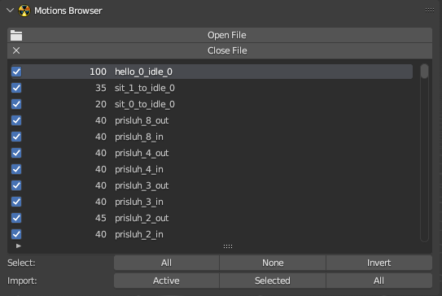

# Motions Browser

___

This panel contains a browser of skeleton animations from [*.skls](../../../reference/file-formats/animations/skl-skls.md) and [*.omf](../../../reference/file-formats/animations/omf.md) files. The browser is needed for quick viewing of animations. When browsing animations, only one animation is imported, which will be removed from the scene if another animation is selected. Animations are imported one at a time, not all animations from a file. To make the browser available, you need to make the armature the active object. Then the browser options and operators will appear. To open a file with animations, you need to run the Open File operator and select it in the blender file browser. After specifying the file, a list with animations and additional operators will be displayed in the panel. To open a new file, you need to use the Open File operator again. To close the current file, you need to run the Close File operator

## Format

Specifies the file format ([*.skls](../../../reference/file-formats/animations/skl-skls.md) or [*.omf](../../../reference/file-formats/animations/omf.md)) to be used when selecting an animation file

## Motions list

List of animations of the currently opened file. To import an animation, you need to click on the name of the animation. Each animation has a check mark to the left of its name, which can be used to select the animation. Selecting animations is used to import them

## Operators

- [Open File](../addon-operators/operator-open-file.md)
- [Close File](../addon-operators/operator-close-file.md)

## Select

The operators in this group allow you to change the selection of animations from the list. The selection is used for import. If an animation is selected, it will be imported when the Import: Selected operator is run.

- `All` - Highlights all animations
- `None` - Deselects all animations
- `Invert` - Inverts the selection

## Import

The operators in this group are used to import animations from the list. If an animation is not imported, it will be removed from the scene when another animation is included

- `Active` - Import active animation
- `Selected` - Import selected animations
- `All` - Import all animations from the list

___

## Sources

[Source](https://github.com/PavelBlend/blender-xray/wiki/Panel-Motions-Browser)
