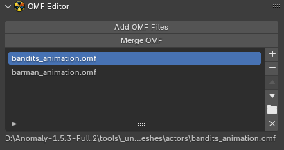

# OMF Editor

___

## About

This panel contains tools for editing [*.omf](../../../reference/file-formats/animations/omf.md) files

## Operators

- [Merge OMF](../addon-operators/operator-merge-omf.md)

___

## Sources

[Blender X-Ray Addon Wiki on GitHub](https://github.com/PavelBlend/blender-xray/wiki/Panel-OMF-Editor)
