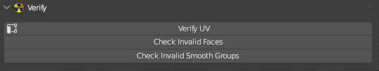

# Verify

___

This panel stores operators to check objects for errors

## Operators

- [Verify UV](../addon-operators/operator-verify-uv.md)
- [Check Invalid Faces](../addon-operators/operator-check-invalid-faces.md)
- [Check Invalid Smooth Groups](../addon-operators/operator-check-invalid-smooth-groups.md)
- [Check Smoothing Groups Incompatibility](../addon-operators/operator-check-smoothing-groups-incompatibility.md)

___

## Sources

[Source](https://github.com/PavelBlend/blender-xray/wiki/Panel-Verify)
