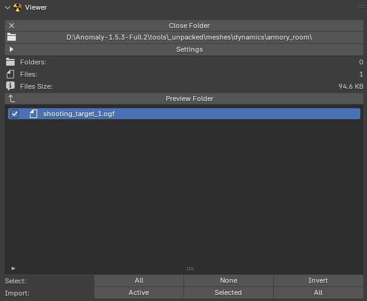

# Viewer

___

## About

This panel contains the file viewer. It is necessary for quick viewing of files that contain 3D models. There is support for viewing [*.object](../../../reference/file-formats/models/object.md), [*.ogf](../../../reference/file-formats/models/ogf.md), [*.dm](../../../reference/file-formats/models/dm.md), [*.details](../../../reference/file-formats/game-levels/details.md). The viewer has a list of files. If you click on a file in the list, it will be imported. If you click on another file, it will be imported and data blocks from the previous file will be removed. When switching between files, previously imported objects, meshes, materials, textures, images, armatures, animations will be deleted. To prevent data blocks from the previous file from being deleted, you should import the file using the operators from the Import group. To scroll through the files in the list, you should put the mouse cursor over the list and press the up or down arrow keys.

## Operators

- [Open Folder](../addon-operators/operator-open-current-folder.md)
- [Close Folder](../addon-operators/operator-close-file.md)
- [Preview Folder](../addon-operators/operator-preview-folder.md)
- [Open Current Folder](../addon-operators/operator-open-current-folder.md)

### Select

Selects files in the list

- `All` - Select all files
- `None` - Deselect all files
- `Invert` - Invert selection

### Import

Imports files

- `Active` - Active file
- `Selected` - Selected files
- `All` - All files in the list

## Parameters

### Use Formats

Specifies which formats to display in the file list: [*.object](../../../reference/file-formats/models/object.md), [*.ogf](../../../reference/file-formats/models/ogf.md), [*.dm](../../../reference/file-formats/models/dm.md), [*details](../../../reference/file-formats/game-levels/details.md)

### Import Motions

Import animations from *.object and \*.ogf files

### Reverse Sort

Set reverse sorting order of files in the list

### Ignore Extension

Ignore file extensions and display all files, not just those with *.object, \*.ogf, \*.dm, \*.details extensions. If a file has another extension, the addon will try to import it as \*.object or \*.ogf or \*.dm or \*.details. The extension is ignored and the file is analyzed by its content

### Show Size

Display the size of files in the list

### Show Date

Display the creation date of files in the list

### Group by Extension

If enabled, the files in the list will be grouped by extension

### Sort

Specifies the type of sorting

- `Name` - by name in alphabetical order
- `Size` - by file size
- `Date` - by file creation date

___

## Sources

[Source](https://github.com/PavelBlend/blender-xray/wiki/Panel-Viewer)
