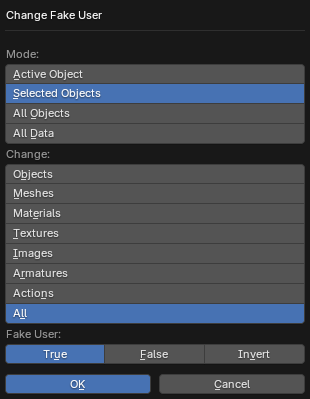

# Change Fake User

___

## About

Operator changes the use of Fake User in data blocks. Makes it easier to change the Fake User parameter on a large number of data blocks. Can be used for animations (for example, which are created after importing skls animations, which can be more than a thousand) or for a large number of materials (for example, which are created after importing locations). It is possible to modify such data blocks: objects, meshes, materials, textures, images, armatures, animations. Using Fake User allows you to save a data block even if it does not have a real user (which is often the case with action data blocks). If you enable Fake User on data blocks, then after reloading the blend file, these blocks will not be deleted

### Mode

An operator mode that specifies which data blocks to modify

- `Active Object` - Data blocks that are linked to the active object
- `Selected Objects` - Data blocks that are linked to the selected objects
- `All Objects` - Data blocks that are linked to all objects in the blend file
- `All Data` - All data blocks, even if they are not associated with objects

### Change

Specifies the types of data blocks for which the Fake User parameter should be changed. It is possible to select several items at once using Shift + LMB

- `Objects` - Objects
- `Meshes` - Meshes
- `Materials` - Materials
- `Textures` - Textures for Internal Render in blender 2.7x
- `Images` - Images
- `Armatures` - Armatures
- `Actions` - Animations
- `All` - All the data blocks listed above

### Fake User

Value to be set in the Fake User parameter of the data blocks

- `True` - Use Fake User
- `False` - Do not use Fake User
- `Invert` - Invert the set value (if Fake User was not used, it will be used and vice versa)

___

## Sources

[Source](https://github.com/PavelBlend/blender-xray/wiki/Panel-Batch-Tools#change-fake-user)
