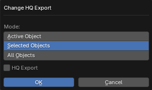

# Change HQ Export Operator

___

## About

Changes the value of the HQ Export parameter from the [X-Ray Engine: Object](../addon-panels/panel-object.md) panel to objects

## Parameters

### Mode

- `Active Object` - Active object
- `Selected Objects` - Selected objects
- `All Objects` - All objects from blend-file

### HQ Export

The value for the HQ Export option from the [X-Ray Engine panel: Object](../addon-panels/panel-object.md)

___

## Sources

[Blender X-Ray Addon Wiki on GitHub](https://github.com/PavelBlend/blender-xray/wiki/Panel-Props-Tools#change-hq-export)
