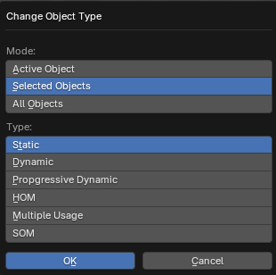

# Change Object Type Operator

___

## About

Changes the type of the object. The type is set in the Type parameter from the X-Ray Engine: Object panel.

### Mode

- `Active Object` - Active object
- `Selected Objects` - Selected objects
- `All Objects` - All objects from blend-file

### Type

Value for the Type parameter from the X-Ray Engine: Object panel.

___

## Sources

[Blender X-Ray Addon Wiki on GitHub](https://github.com/PavelBlend/blender-xray/wiki/Panel-Props-Tools#change-object-type)
