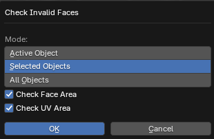

# Check Invalid Faces

___

## About

Checks for invalid faces in mesh objects. After the operator operation, objects with problematic polygons will be highlighted, and objects with correct polygons will not be highlighted. In the editing mode problem polygons or vertices will have selection

### Mode

- `Active Object` - Active object
- `Selected Objects` - Selected objects
- `All Objects` - All objects from blend-file

### Check Face Area

Check for polygons that have an area close to zero

### Check UV Area

Check for polygons that have UV map area close to zero

___

## Sources

[Source](https://github.com/PavelBlend/blender-xray/wiki/Panel-Verify#check-invalid-faces)
