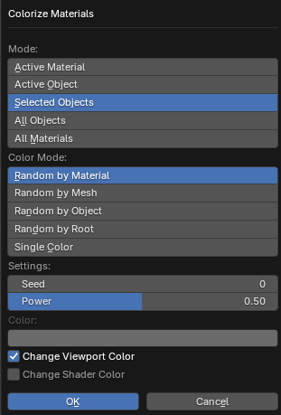

# Colorize Materials

___

## About

Changes the color of materials to random colors. The color is set for the `Viewport Display` > `Color` parameter in the `Material` tab of the `Properties` window, which specifies the color of the material in the viewport in `Material` mode ([Color](https://docs.blender.org/manual/en/3.6/editors/3dview/display/shading.html#solid) parameter). It is also possible to specify the shader color

### Mode

An operator mode that specifies which materials to change the color of

- `Active Material` - Active material of the active object
- `Active Object` - All materials of the active object
- `Selected Objects` - All materials of the selected objects
- `All Objects` - All materials of all objects of the blend-file
- `All Materials` - All materials of the blend file

### Color Mode

A color mode that specifies how to generate colors to materials. The random number to generate the color is generated from the name of the data block. This can be the name of a material, mesh, object, root object

- `Random by Material` - Each material is assigned its own unique color, which is generated by the material name
- `Random by Mesh` - All mesh materials are given one unique color, which is generated by mesh name
- `Random by Object` - All materials of the object are given one unique color, which is generated by the name of the object
- `Random by Root` - All materials of all descendants of the root object are given one unique color, which is generated by the root object name
- `Single Color` - Materials are given a single color, which is specified in the `Color` parameter below

### Seed

Initial value for the color generator to get different variations of the result

### Power

Color saturation

### Color

Specifies the material color for `Single Color` mode

### Change Viewport Color

If enabled, the material changes to `Viewport Display` > `Color`

### Change Shader Color

If enabled, the material changes the shader color in the nodes (socket `Color` or `Base Color` in the shader node)

___

## Sources

[Source](https://github.com/PavelBlend/blender-xray/wiki/Panel-Batch-Tools#colorize-materials)
