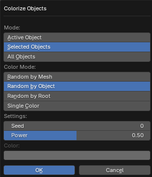

# Colorize Objects Operator

___

## About

Changes the color of objects to random colors. The color is set for the `Viewport Display` > `Color` parameter in the `Object` tab of the `Properties` window, which specifies the color of the object in the viewport in Object display mode ([Color](https://docs.blender.org/manual/en/3.6/editors/3dview/display/shading.html#solid) parameter)

### Mode

Operator mode, which specifies which objects to change the color of

- `Active Object` - Active object
- `Selected Objects` - Selected objects
- `All Objects` - All objects of the blend file

### Color Mode

A color mode that specifies how to generate colors to objects. The random number to generate the color is generated from the name of the data block. This can be the name of a mesh, object, root object

- `Random by Mesh` - Object is given a unique color, which is generated by mesh name
- `Random by Object` - Object is given a unique color, which is generated by the object name
- `Random by Root` - All children of the root object are given one unique color, which is generated by the name of the root object
- `Single Color` - Objects are given a single color, which is specified in the Color parameter below

### Seed

Initial value for the color generator to get different variations of the result

### Power

Color saturation

### Color

Specifies the color of the object for `Single Color` mode

___

## Sources

[Source](https://github.com/PavelBlend/blender-xray/wiki/Panel-Batch-Tools#colorize-objects)
