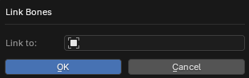

# Оператор Link Bones

___

## About

Binds the bones of the active armature to the one selected in the `Link to` parameter. The bones are linked using the `Copy Transforms` constrain. Constraints are named `!-xray-link`. In order for a bone of the active armature to be linked, there must be a bone with the same name in the `Link to` armature. The transformations of the bones in `Edit Mode` must match for this to work correctly. Linking the bones of one armature to the bones of another can be useful for creating animations of `hud`-models of weapons from `CS`/`CoP`. To do this, you need to import a hand file and a weapon file, then duplicate their armatures and combine them. As a result, you will get three armatures: armature of hands, armature of weapons and combined armature of hands with weapons. After that, you need to link the arm and weapon armatures to the last armature using this `Link Bones` operator. Thanks to the `Copy Tranforms` contraints, the linked bones will have the same transformations as the bones in the merged armature. This will allow you to create animations for a single joined armature, and the animations for the linked armatures will match. This method makes it easier to create animations, as it is easier to animate one armature instead of two, as you won't have to switch between two objects and synchronize different animations. To export correctly, you need to specify the object of the merged armature in the [Dependency](../addon-panels/panel-object.md) parameter of the linked armatures. When exporting, you must select the linked armature. It is not necessary to select and export the merged armature.

### Link to Parameter

An armature object to which to tie the bones

___

## Sources

[Source](https://github.com/PavelBlend/blender-xray/wiki/Operator-Link-Unlink-Bones#%D0%9E%D0%BF%D0%B5%D1%80%D0%B0%D1%82%D0%BE%D1%80-link-bones)
