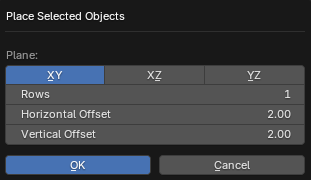

# Place Selected Objects

___

## About

This operator changes the positions of selected root objects so that they have unique coordinates and are positioned at the same vertical and horizontal offsets

### Place

Specifies the plane on which to place objects

- `XY` - horizontal plane
- `XZ` - vertical plane from front view
- `YZ` - vertical plane from the side view

### Rows

The number of rows on which to place objects

### Horizontal Offset

Horizontal offset of objects relative to the plane of placement

### Vertical Offset

Vertical offset of objects relative to the plane of placement

___

## Sources

[Source](https://github.com/PavelBlend/blender-xray/wiki/Panel-Batch-Tools#place-selected-objects)
