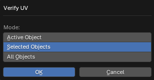

# Verify UV

___

## About

Checks the correctness of UV-maps of meshed objects. It is needed because the xrLC geometry compiler for PM sometimes does not correctly process texture coordinates that are outside the range -32.0-32.0. The operator selects polygons that fall outside these limits. The units of the range are the image size. One image height/width is equal to 1.0. After the operator operation, objects that have correct UV-coordinates will not be selected. And those objects that have polygons with problematic UV-coordinates will be selected. In the editing mode the problematic polygons will be highlighted

### Mode

- `Active Object` - Active object
- `Selected Objects` - Selected objects
- `All Objects` - All objects from blend-file

___

## Sources

[Blender X-Ray Addon Wiki on GitHub](https://github.com/PavelBlend/blender-xray/wiki/Panel-Verify#verify-uv)
