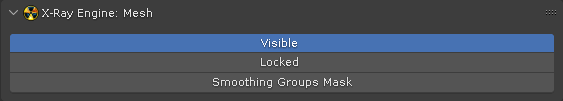

# X-Ray Engine Mesh

___

## About

This panel stores the mesh parameters for *.object format.

## Location

`Properties` window > `Data` tab of the mesh object

## Parameters

### Visible

Sets the visibility in the viewport in the X-Ray SDK.

### Locked

TODO

### Smoothing Groups Mask

This parameter is not used during export, but for imported objects it means Max-format of smoothing groups if enabled. Maya-format if off. Maya format is always used during export.

___

## Sources

[Source](https://github.com/PavelBlend/blender-xray/wiki/Panel-XRay-Engine-Mesh)
