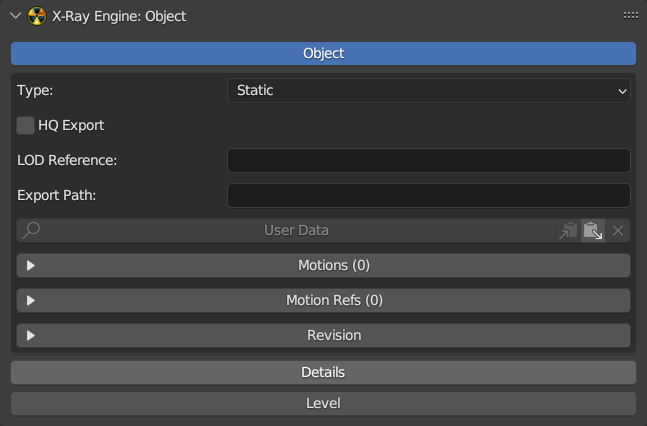

# X-Ray Engine: Object

___

## About

This page describes the X-Ray Engine: Object panel

## Location

`Properties` window > `Object` tab

## Object Block Parameters

### Object

If enabled the object is a root object.

### Type

Object Type.

- `Static` - [Static](../../../glossary/glossary.md#StaticObject) (Level geometry).
- `Dynamic` - [Dynamic](../../../glossary/glossary.md#DynamicObject) (Object with a skeleton).
- `Progressive Dynamic` - [Dynamic](../../../glossary/glossary.md#ProgressiveMeshes) with levels of detail (in game, the object will change the number of polygons, depending on the distance to the game camera)
- `HOM` - Level geometry cutoff (used to create [*.hom](../../../reference/file-formats/game-levels/hom.md) files)
- `Multiple Usage` - [Multiple used objects](../../../glossary/glossary.md#MultiplyUsageObject) (trees, transportation, rocks, etc.)
- `Sound Occluder` - Level sound cutoff (used to create [*.som](../../../reference/file-formats/game-levels/som.md) files)
- `Custom` - Customizable (object type is implemented in the form of flags, so this type has the ability to specify each flag arbitrarily)

### HQ Export

Parameter which is similar to HQ Geometry parameter in [Actor Editor](../../sdk/actor-editor/actor-editor.md) from X-Ray SDK 0.7. If it is enabled, when exporting [*.object](../../../reference/file-formats/models/object.md) file to [*.ogf](../../../reference/file-formats/models/ogf.md) using Actor Editor, mesh optimization will not be used

### LOD Reference

String that specifies the relative path to the *.ogf file of the LOD-model

### Export Path

Relative path to the object that is used during a bulk export or when exporting to .level, .part, .group. If the Use Export Paths option is enabled when exporting to *.object or \*.ogf, this path will be added to the path of the folder to which the export is performed. This is necessary to export files to the same folders from which they were imported.

For example, if the object name is `test_object` and the export path to *.object is `c:\xray_sdk\rawdata\objects` and the Export Path parameter is `test_folder\test_objects\` then the final path of the \*.object file will be `c:\xray_sdk\rawdata\objects\test_folder\test_objects\test_objects\test_object`.

If you export to .level, .part, .group formats, Export Path will be used to generate a relative path to the object in the X-Ray SDK.

For example, if the object name is test_object.object, the Export Path parameter is test_folder\test_objects\, then the relative path that will be written to the file will be test_folder\test_objects\test_object. The .object extension will not be saved. Also, the numbers and dot at the end of the object name will not be saved (for example, the name test.003 will become test, which will allow you to have many objects in the scene that refer to the same *.object file). Next to the Export Path parameter there is an operator with a folder icon, which can be used to specify a value for this parameter. After launching the file browser will open, then you need to specify the folder located in the directory, which is specified in the Objects Folder or Meshes Folder parameter in the addon settings. After that Export Path will be generated, relative to the folder rawdata\objects or gamedata\meshes.

### User Data

A string that specifies the user data. To display the contents of User Data, click the User Data button. To the right are the buttons for copying, pasting and deleting User Data.

### Motions

A list of animations of the object. Selected animation can be only one and has a check mark on the left. These animations are saved in *.object, \*.ogf, \*.skls, \*.omf files when exporting. To the right of the list there are operators to control the list items. Operator descriptions are from top to bottom:

- Add a new list item
- Delete selected list item
- Move selected animation up one position
- Move selected animation down one position
- Add to the list all blend-file animations that have keys for root-object armature bones
- Clear the list of animations by deleting those items that point to non-existing action data blocks or have an empty value
- Delete all items in the list
- Copy a list of animations to the clipboard for later pasting to other objects
- Paste copied animation list from clipboard
- Sort a list of animations. The sort operator has parameters:
  - Sort by - указывает метод сортировки
    - Action Name - in alphabetical order by action data block name
    - Export Name - in alphabetical order by Export Name
    - Action Length - first sorts by animation length then alphabetically if the animation lengths are the same
    - Reverse Sort - specifies the reverse method of sorting descending instead of ascending

### Play Active Motion

If enabled, the animation selected in the Motions list will be set to the armature. You can scroll through the animations in the list and view them in a 3D window.

### Custom Names

Use customizable animation names. If this option is disabled, the name of the Action data block will be written to the file when exporting. If this option is enabled, animations can be given an Export Name that is used during export. If the Export Name parameter is empty, the name of the Action data block will be used.

### Show

Specifies which animation names to display.

- Action - name of Action data block
- Export - name used for export and specified in the Export Name parameter
- Both - display both names

### Dependency

Dependency in the form of another object. This is used when animations depend on the animations of other objects. If an object is specified in this parameter, when you export or enable animation with the Play Active Motion parameter, the specified object will be set to the same animation as the current one.
For example, this can be used to animate hud models of weapons from CS/CoP. A weapon skeleton can have Copy Transforms contreints for the wpn_body bone, which copy the lead_gun bone transformations of the arm skeleton. If the arm skeleton is not set to the same animation as the weapon when exporting, the weapon's animation will be the same for all animations in the list.

### Motion Refs

List of links to external *.omf files with animations. The right side of the list has operators to control the list items. Descriptions of operators from top to bottom:

- Add a list item
- Delete the selected list item
- Move the selected list item up one position
- Move the selected list item down one position
- Delete all items in the list
- Copies the list of items to the clipboard
- Inserts a list of items from the clipboard
- Sorts the list of items alphabetically. This operator has a parameter:
  - Reverse Sort - specifies the reverse method of sorting in descending instead of ascending order
- Specifies list items by selecting *.omf files. After launching the operator, a file browser will open, where you need to select one or more **.omf files. To generate links to files, you need to specify the Meshes Folder parameter in the addon settings. The addon will generate relative paths to \*.omf files based on Meshes Folder, so you should select only those \*.omf files that are inside Meshes Folder.

### Load Active Motion Refs

If enabled, the selected motion reference will be added to the Motions Browser. The Format parameter specifies which animation format to use: *.skls or \*.omf. The file with animations must be located in Objects Folder or Meshes Folder, which are set in the addon settings.

### Owner Name

Owner Name

### Created Time

Time of model creation. Time format is displayed in the tooltip below.

### Moder Name

Moder Name.

### Modified Time

Model Modification Date.

## Details Block Parameters

### Details

If enabled, the object is the main details-object that stores the main parameters.

### No Waving

If enabled, the grass models will not sway in the wind.

### Min Scale

Minimum Scale.

### Max Scale

Maximum Scale.

### Detail Index

Model number in the *.details file.

### Detail Color

Color of detailed model. It is used only inside the blender. This value is not saved to the file when exporting to *.details. If you change the Detail Index parameter, the color is automatically re-generated. This parameter can be copied for use when painting in the Image Editor window or when painting over the model in Texture Paint mode in the 3D Veiwport window.

### Meshes Object

Specifies the object that is the parent of the vegetation meshes. Vegetation meshes must have this object as a parent.

### Slots Base Object

Specifies the object that specifies the lower boundary of the slots.

### Slots Top Object

Specifies the object that specifies the upper boundary of the slots.

### Format

Lighting Format.

- Builds 1569-CoP - format for *.details files from builds from 1569 to CoP. It contains three components:
  - Light from static sources
  - Sun shadows
  - Hemi lighting

- 1096-1558 - format for *.details files from builds from 1096 to 1558. Contains one common lighting component.

### Lights

Specifies the image for static light (for Builds 1569-CoP format) or general light (for 1096-1558 format).

### Hemi

Specifies the image for hemi lighting.

### Shadows

Specifies the image for sun shadows.

### Mesh 0/1/2/3

These four parameters specify four images that specify the density and type of grass. Each grass slot can have up to four grass models. Therefore, the grass is specified by four images. Black pixels in these images mean that there is no mesh. The grass model is specified in the RGB components of the image. The color of the models can be copied from the Detail Color parameter. Grass density is set using the Alpha channel of the image.

## Details Data Block

### Pack Details Images

Packs all images that are specified in the parameters in the Details block. This option is used to automatically pack all images into a blend file. Usually this operator is run after editing images, so that changes are not lost after reloading the blend file. This operator is similar to the Image > Pack operator from the Image Editor window, except that it performs packing for all images at once.

## Level Block Parameters

### Level

If enabled, the object is part of the game level. For example, the object can be a visual, portal, light source, etc.

### Type

Level Object Type.

- Level - Location object that stores basic settings
- Visual - Visual object
- Portal - Portal
- Light - Dynamic light source that is used on dynamic lighting in the game
- CForm - Collision object

### Sectors Object

Specifies a sectors object. This object must have sector objects as children.

### Portals Object

Specifies a portals object. This object must have portal objects as children. Portal is a mesh object with the type set to Portal.

### Lights Object

Specifies a light source object. This object must have as children objects whose type is set to Light.

### Glows Object

Specifies an object of light sources. This object must have glow objects as children. Glow is a mesh object that has a texture and an engine shader installed.

### Visual Type

Type of visual object.

### Use Fastpath Geometry

When exporting to level, level.geom, level.geomx create a geometry for the object to calculate shadows on dynamic lighting. This geometry is saved to the file level.geomx and allows you to create dynamic shadows on the object. Usually this option is disabled for transparent surfaces (barbed wire, mesh, etc.).

### Color Scale: Light, Hemi, Sun

Color of lighting from light sources, intensity of sun lighting, intensity of hemi lighting. Sun and hemi have no color only brightness. If you set color, it will be ignored when exporting.

### Color Bias: Light, Hemi, Sun

Аналогично Color Scale, но для ??? (TODO).

### Sector Front

Object which is the front sector.

### Sector Back

Object which is the back sector.

### Controller

Influence.

- Static - light from light sources
- Hemi - Hemi light
- Sun - Sun Light

### Light Type

Light source type.

- Point - Point
- Spot - Spot
- Directional - Directional

### Diffuse

Basic diffuse color.

### Specular

Цвет бликов.

### Ambient

Ambient color.

### Cutoff Range

Radius of the light source. Similar to the Range parameter in Level Editor.

### Falloff

Falloff

### Constant Attenuation

Constant light attenuation.

### Linear Attenuation

Linear light attenuation.

### Quadratic Attenuation

Quadratic light attenuation.

### Inner Angle Theta

Inner angle of spotlight cone.

### Outer Angle Phi

Outer angle of spotlight cone.
