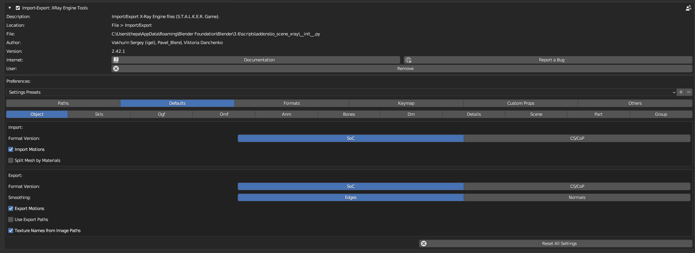

# Defaults

___

## About

Here you can set default parameters for many operators

___

## Object

<table><thead>
  <tr>
    <th>Operator</th>
    <th>Function</th>
    <th>Parameter</th>
    <th>Description</th>
  </tr></thead>
<tbody>
  <tr>
    <td rowspan="4">Import</td>
    <td rowspan="2">Format Version</td>
    <td>SoC</td>
    <td></td>
  </tr>
  <tr>
    <td>CS/CoP</td>
    <td></td>
  </tr>
  <tr>
    <td>Import Motions</td>
    <td>-</td>
    <td></td>
  </tr>
  <tr>
    <td>Split Mesh by Materials</td>
    <td>-</td>
    <td></td>
  </tr>
  <tr>
    <td rowspan="7">Export</td>
    <td rowspan="2">Format Version</td>
    <td>SoC</td>
    <td></td>
  </tr>
  <tr>
    <td>CS/CoP</td>
    <td></td>
  </tr>
  <tr>
    <td rowspan="2">Smoothing</td>
    <td>Edges</td>
    <td></td>
  </tr>
  <tr>
    <td>Normals</td>
    <td></td>
  </tr>
  <tr>
    <td>Export Motions</td>
    <td>-</td>
    <td></td>
  </tr>
  <tr>
    <td>Use Export Paths</td>
    <td>-</td>
    <td></td>
  </tr>
  <tr>
    <td>Texture Names from Image Paths</td>
    <td>-</td>
    <td></td>
  </tr>
</tbody>
</table>

___

## Skls

<table><thead>
  <tr>
    <th>Operator</th>
    <th>Function</th>
    <th>Description</th>
  </tr></thead>
<tbody>
  <tr>
    <td>Import</td>
    <td>Add Actions to Motion List</td>
    <td></td>
  </tr>
</tbody>
</table>

___

## Ogf

<table><thead>
  <tr>
    <th>Operator</th>
    <th>Function</th>
    <th>Parameter</th>
    <th>Description</th>
  </tr></thead>
<tbody>
  <tr>
    <td>Import</td>
    <td>Import Motions</td>
    <td>-</td>
    <td></td>
  </tr>
  <tr>
    <td rowspan="6">Export</td>
    <td rowspan="2">Format Version</td>
    <td>SoC</td>
    <td></td>
  </tr>
  <tr>
    <td>CS/CoP</td>
    <td></td>
  </tr>
  <tr>
    <td>Export Motions</td>
    <td>-</td>
    <td></td>
  </tr>
  <tr>
    <td>High Quality Motions</td>
    <td>-</td>
    <td></td>
  </tr>
  <tr>
    <td>Use Export Paths</td>
    <td>-</td>
    <td></td>
  </tr>
  <tr>
    <td>Texture Names from Image Paths</td>
    <td>-</td>
    <td></td>
  </tr>
</tbody>
</table>

___

## Omf

<table><thead>
  <tr>
    <th>Operator</th>
    <th>Function</th>
    <th>Parameter</th>
    <th>Description</th>
  </tr></thead>
<tbody>
  <tr>
    <td rowspan="3">Import</td>
    <td>Import Motions</td>
    <td>-</td>
    <td></td>
  </tr>
  <tr>
    <td>Import Bone Parts</td>
    <td>-</td>
    <td></td>
  </tr>
  <tr>
    <td>Add Actions to Motion List</td>
    <td>-</td>
    <td></td>
  </tr>
  <tr>
    <td rowspan="6">Export</td>
    <td rowspan="3">Export Mode</td>
    <td>Overwrite</td>
    <td></td>
  </tr>
  <tr>
    <td>Add</td>
    <td></td>
  </tr>
  <tr>
    <td>Replace</td>
    <td></td>
  </tr>
  <tr>
    <td>Export Motions</td>
    <td>-</td>
    <td></td>
  </tr>
  <tr>
    <td>Export Bone Parts</td>
    <td>-</td>
    <td></td>
  </tr>
  <tr>
    <td>High Quality Motions</td>
    <td>-</td>
    <td></td>
  </tr>
</tbody>
</table>

___

## Anm

<table><thead>
  <tr>
    <th>Operator</th>
    <th>Function</th>
    <th>Parameter</th>
    <th>Description</th>
  </tr></thead>
<tbody>
  <tr>
    <td>Import</td>
    <td>Create Linked Camera</td>
    <td>-</td>
    <td></td>
  </tr>
  <tr>
    <td rowspan="3">Export</td>
    <td rowspan="3">Format Version</td>
    <td>3</td>
    <td></td>
  </tr>
  <tr>
    <td>4</td>
    <td></td>
  </tr>
  <tr>
    <td>5</td>
    <td></td>
  </tr>
</tbody>
</table>

___

## Bones

<table><thead>
  <tr>
    <th>Operator</th>
    <th>Function</th>
    <th>Description</th>
  </tr></thead>
<tbody>
  <tr>
    <td rowspan="2">Import</td>
    <td>Import Bone Parts</td>
    <td></td>
  </tr>
  <tr>
    <td>Import Bone Properties</td>
    <td></td>
  </tr>
  <tr>
    <td rowspan="2">Export</td>
    <td>Export Bone Parts</td>
    <td></td>
  </tr>
  <tr>
    <td>Export Bone Properties</td>
    <td></td>
  </tr>
</tbody>
</table>

___

## Dm

<table><thead>
  <tr>
    <th>Operator</th>
    <th>Function</th>
    <th>Description</th>
  </tr></thead>
<tbody>
  <tr>
    <td>Export</td>
    <td>Texture Names from Image Paths</td>
    <td></td>
  </tr>
</tbody>
</table>

___

## Details

<table><thead>
  <tr>
    <th>Operator</th>
    <th>Function</th>
    <th>Parameter</th>
    <th>Description</th>
  </tr></thead>
<tbody>
  <tr>
    <td rowspan="4">Import</td>
    <td rowspan="2">Format Version</td>
    <td>Builds 1096 - 1230</td>
    <td></td>
  </tr>
  <tr>
    <td>Builds 1233 - 1558</td>
    <td></td>
  </tr>
  <tr>
    <td>Models in Row</td>
    <td>-</td>
    <td></td>
  </tr>
  <tr>
    <td>Import Slots</td>
    <td>-</td>
    <td></td>
  </tr>
  <tr>
    <td rowspan="3">Export</td>
    <td rowspan="3">Format Version</td>
    <td>Builds 1569 - CoP</td>
    <td></td>
  </tr>
  <tr>
    <td>Builds 1233 - 1558</td>
    <td></td>
  </tr>
  <tr>
    <td>Builds 1096 - 1230</td>
    <td></td>
  </tr>
</tbody>
</table>

___

## Scene

<table><thead>
  <tr>
    <th>Operator</th>
    <th>Function</th>
    <th>Parameter</th>
    <th>Description</th>
  </tr></thead>
<tbody>
  <tr>
    <td rowspan="3">Import</td>
    <td rowspan="2">Format Version</td>
    <td>SoC</td>
    <td></td>
  </tr>
  <tr>
    <td>CoP</td>
    <td></td>
  </tr>
  <tr>
    <td>Split Mesh by Materials</td>
    <td>-</td>
    <td></td>
  </tr>
</tbody>
</table>

___

## Part

<table><thead>
  <tr>
    <th>Operator</th>
    <th>Function</th>
    <th>Parameter</th>
    <th>Description</th>
  </tr></thead>
<tbody>
  <tr>
    <td rowspan="3">Import</td>
    <td rowspan="2">Format Version</td>
    <td>SoC</td>
    <td></td>
  </tr>
  <tr>
    <td>CoP</td>
    <td></td>
  </tr>
  <tr>
    <td>Split Mesh by Materials</td>
    <td>-</td>
    <td></td>
  </tr>
  <tr>
    <td rowspan="2">Export</td>
    <td rowspan="2">Format Version</td>
    <td>SoC</td>
    <td></td>
  </tr>
  <tr>
    <td>CoP</td>
    <td></td>
  </tr>
</tbody>
</table>

___

## Group

<table><thead>
  <tr>
    <th>Operator</th>
    <th>Function</th>
    <th>Parameter</th>
    <th>Description</th>
  </tr></thead>
<tbody>
  <tr>
    <td rowspan="3">Import</td>
    <td rowspan="2">Format Version</td>
    <td>SoC</td>
    <td></td>
  </tr>
  <tr>
    <td>CoP</td>
    <td></td>
  </tr>
  <tr>
    <td>Split Mesh by Materials</td>
    <td>-</td>
    <td></td>
  </tr>
</tbody>
</table>

___

## Sources

[Source](https://github.com/PavelBlend/blender-xray/wiki/Preferences-Defaults)
