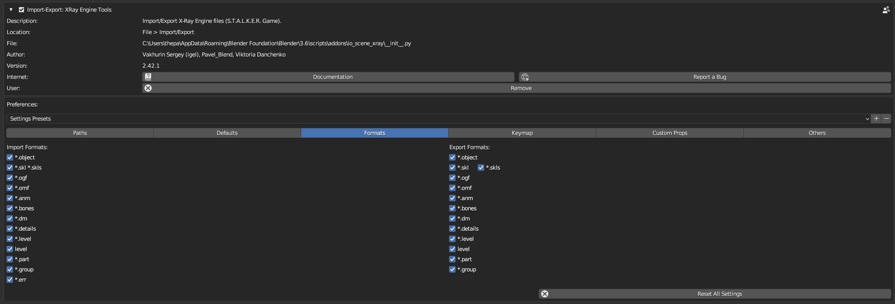

# Formats

___

## About

This page describes the addon settings in the `Formats` category.

___

In this category you can switch off support for import/export of formats. If format import/export is turned off, it will not appear in the import/export menu. Also import/export operators are removed from the `Import/Export` pane in the `3D Viewport` window in the `N-panel`, in the `X-Ray tab`. And the panels and parameters that are used by this format will not be displayed in the interface. Different formats affect the display of different panels and parameters. The display of some panels depends on several formats. This feature is necessary to simplify the interface, so that unnecessary parameters and import/export operators, which are not used by the user, are not displayed. To hide panels, you should disable such formats:

### X-Ray Engine: Action

- [*.object](../../../reference/file-formats/models/object.md)
- [*.skl](../../../reference/file-formats/animations/skl-skls.md)
- [*.skls](../../../reference/file-formats/animations/skl-skls.md)
- [*.ogf](../../../reference/file-formats/models/ogf.md)
- [*.omf](../../../reference/file-formats/animations/omf.md)
- [*.anm](../../../reference/file-formats/animations/anm.md)

### X-Ray Engine: Armature

- [*.object](../../../reference/file-formats/models/object.md)
- [*.skl](../../../reference/file-formats/animations/skl-skls.md)
- [*.skls](../../../reference/file-formats/animations/skl-skls.md)
- [*.ogf](../../../reference/file-formats/models/ogf.md)
- [*.omf](../../../reference/file-formats/animations/omf.md)
- [*.bones](../../../reference/file-formats/models/bones.md)

### X-Ray Engine: Bone

- [*.object](../../../reference/file-formats/models/object.md)
- [*.skl](../../../reference/file-formats/animations/skl-skls.md)
- [*.skls](../../../reference/file-formats/animations/skl-skls.md)
- [*.ogf](../../../reference/file-formats/models/ogf.md)
- [*.omf](../../../reference/file-formats/animations/omf.md)
- [*.bones](../../../reference/file-formats/models/bones.md)

### X-Ray Engine: Material

`Shader`, `Compile`, `Material`, `Two Sided` parameters are always displayed and cannot be disabled. To hide parameters from `Level Visual` and `Level CForm` blocks, it is necessary to disable these formats:

- [level](../../../reference/file-formats/game-levels/level.md)

### X-Ray Engine: Mesh

- [*.object](../../../reference/file-formats/models/object.md)
- [*.level](../../../reference/file-formats/game-levels/dot-level.md)
- [*.part](../../../reference/file-formats/game-levels/part.md)
- [*.group](../../../reference/file-formats/models/group.md)

### X-Ray Engine: Object

To hide parameters from the `Object` block, you need to disable such formats:

- [*.object](../../../reference/file-formats/models/object.md)
- [*.skl](../../../reference/file-formats/animations/skl-skls.md)
- [*.skls](../../../reference/file-formats/animations/skl-skls.md)
- [*.ogf](../../../reference/file-formats/models/ogf.md)
- [*.omf](../../../reference/file-formats/animations/omf.md)
- [*.level](../../../reference/file-formats/game-levels/dot-level.md)
- [*.part](../../../reference/file-formats/game-levels/part.md)
- [*.group](../../../reference/file-formats/models/group.md)

To hide the `Details` block:

- [*.dm](../../../reference/file-formats/models/dm.md)
- [*.details](../../../reference/file-formats/game-levels/details.md)

To hide the `Level` block:

- [level](../../../reference/file-formats/game-levels/level.md)

___

## Sources

[Source](https://github.com/PavelBlend/blender-xray/wiki/Preferences-Formats)
