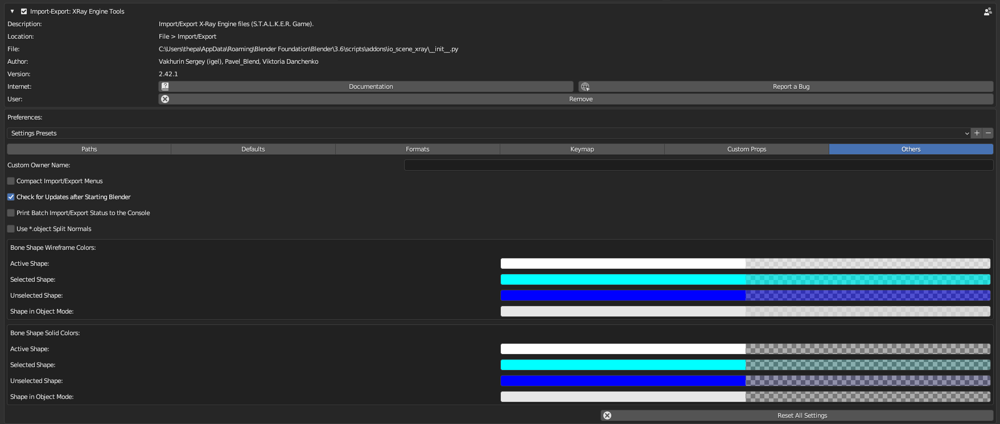

# Others

___

## About

This page describes the addon settings in the Others category. This category contains different settings that do not fit into any general category.

___

### Custom Owner Name

This parameter specifies an arbitrary author name. The author name is written to the files during export. If this value is not empty, it will be used during export to `*.object`, `*.ogf`, `*.part`. If empty, the author name will contain the computer name and user name (e.g. `\\DESKTOP-PC\Admin`).

### Compact Import/Export Menus

If this option is enabled, in the import/export menu the operators will be in a compact form and will be grouped in one `X-Ray` submenu. Operators will have the following path: `File` > `Import` > `X-Ray` > `Source Object (*.object)`. If off, the operators will be added to `Import/Export` menu as standard operators (without submenu). And the path to them will be like this: `File` > `Import` > `X-Ray object (*.object)`. If you switch on the compact menu mode, you can reduce the import/export menu clutter and make it easier to find `X-Ray` operators.

### Check for Updates after Starting Blender

When starting blender, check for a new version of the addon.

### Print Batch Import/Export Status to the Console

If enabled, paths to imported/exported files will be printed to the console during import/export, which will allow you to monitor the status of import/export when it takes a long time.

### Use *.object Split Normals

If this option is activated, then when importing/exporting `*.object` files `split`-normals of smoothing will be read/written. This feature is not available in the official `X-Ray SDK`. To support `split`-normals you need to use corrected versions of `X-Ray SDK` or other modding software. When exporting, the standard smoothing groups are also preserved, which allows the resulting `*.object` files to be used in any version of `X-Ray SDK`, even if it does not support `split`-normals. If the parameter is deactivated, `split`-normals will not be imported/exported to/from `*.object` and the resulting files will correspond to the official version of `X-Ray SDK`. This setting is in the addon settings, not in the import/export operator settings, as this setting is not an import/export setting, but a format setting. This setting extends the `*.object` format. More about Smoothing: Smoothing

### Bone Shape Colors

The parameters in this block specify the color of bone shapes and bone mass centres in the `3D Viewport` window. For shapes and mass centres to be displayed, you must enable the Display Bone Shapes and Display Bone Mass Centers parameters for the armature.

- `Active Shape` - color of active bone shape in Pose Mode.
- `Selected Shape` - shape color of selected bones in Pose Mode.
- `Unselected Shape` - shape color of unselected bones in Pose Mode.
- `Shape in Object Mode` - shape color of all bones in Object Mode.

___

## Sources

[Blender X-Ray Addon Wiki on GitHub](https://github.com/PavelBlend/blender-xray/wiki/Preferences-Others)
