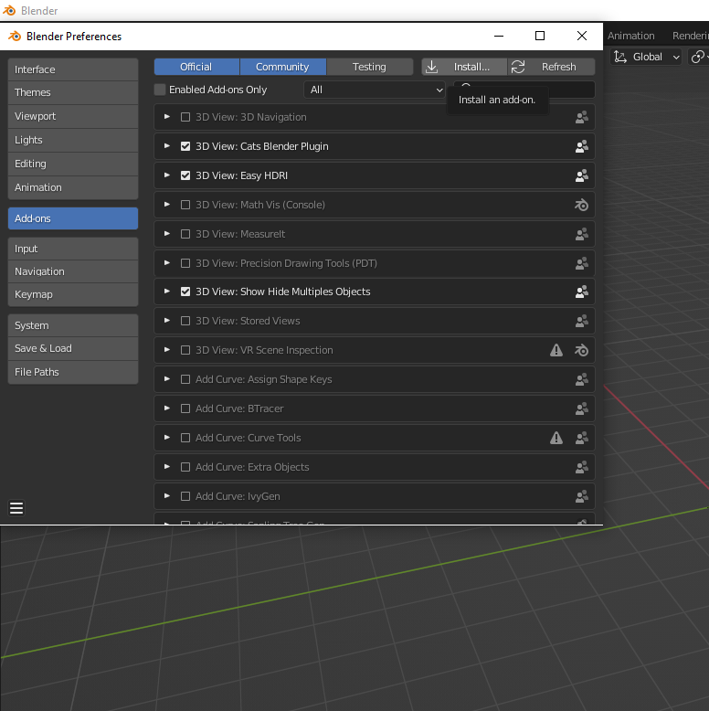
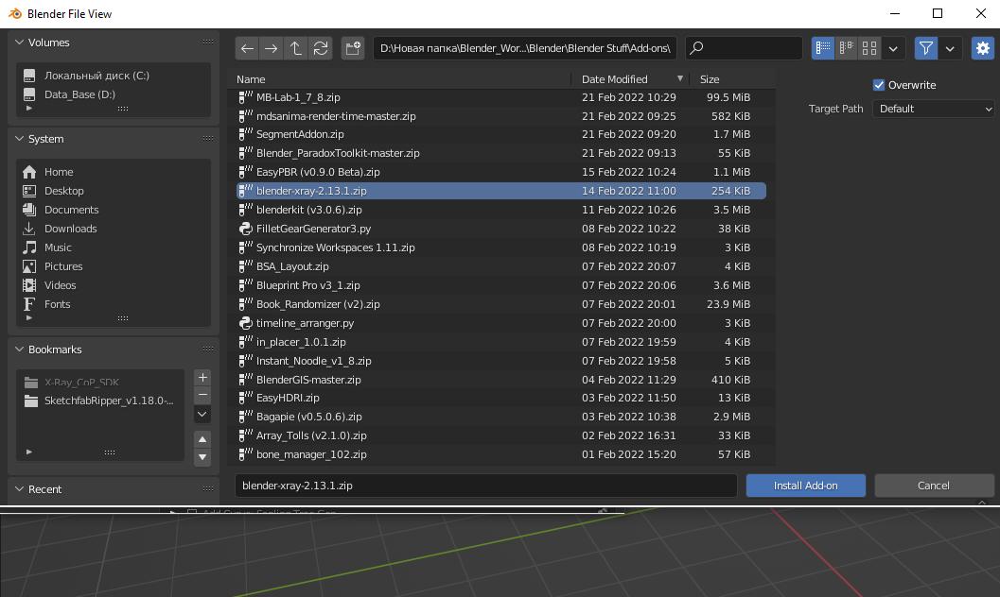

# Installation

___

1. [Download the latest version of the addon](https://github.com/PavelBlend/blender-xray/releases)

2. Go into Blender. Click "Edit" > Preferences

    

3. Add-ons > Install

    

4. Choose the downloaded version of the addon.

    

5. Blender will then notify you that the addon has been successfully installed.
