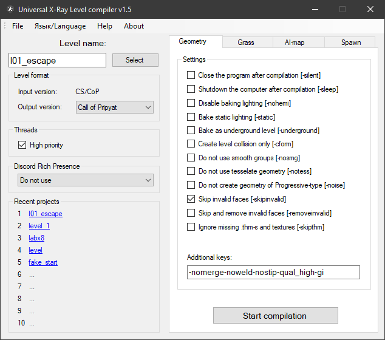

# Universal x64 level compilers

___

|  |  |
|---|---|
| Program Developer | GCS Game Word SkyLoader Abramcumner K.D. |
| Described Version | 1.6 beta |
| Discussion Forum | [Ap-pro forum topic](https://ap-pro.ru/forums/topic/3341-universalnye-kompilyatory-urovney-h64) |

___

## About

Universal level compiler that supports the compilation format for games of all series and has many keys to compile

## Compilation of compilers

- Geometry compiler (SoC, CS, CoP)
- Grass compiler (SoC, CS, CoP)
- AI grid compiler (SoC, CS, CoP)
- Spawn Compiler (SoC, CS, CoP)

## Features

- Support for x64
- Support for major games in the series (except for spawn formats)
- All compilers united in one application
- Interface completely rewritten in WinForms
- Added compiler menu, where you can choose a project level, set certain settings and run the compilation
- A system for saving and loading settings of recent projects has been added
- The number of threads created is no longer fixed, but depends on the number of processor cores
- Migration to DirectXTex library to replace FreeImage and nvDXT now obsolete
- Removed rendering of RGB and Sun lighting components, leaving only Hemi
- Some phases of compilation and code parsing of third-party libraries were made
- Integrated Discord Rich Presence to be able to monitor the status of compilation on a remote PC
- Added an option to automatically shutdown the PC after compilation
- Implemented a progress bar in the taskbar to display the current compilation status when minimized
- Added keys for the accelerated compilation of levels for testing purposes.
- Added experimental switches to disable some compilation phases and bypass KKS parameters
- Added major changes to past compilers
- Expanded information output on some bugs
- Fixed some crashes of the original compilers
- Possibility to force the use of smoothing groups on a certain geometry even if the `-nosmg` key is present (To use smoothing groups on a model it is necessary to assign a compile shader with `_smg` in its name to its materials (e.g. `def_vertex\def_vertex_smg`). The compile shader itself is enough to declone from the original one and rename it with this postfix)
- Possibility to disable tessellation on certain geometry (for example, on nosun boxes). To do this you need to name a compile shader with `_no_tess` in its name. Keep in mind that disabling tessellation can cause problems with UV
- Ability to disable shadow baking from certain [MU models](../../glossary/glossary.md#MultiplyUsageObject). Compile shaders of MU models must have `_no_mu_shadow` in the name. The difference between this solution and the usual disabling of the `Cast Shadow` checkbox is that in this case self-darkening of the MU model will be applied and the model will not be highlighted
- Added support for Intel Embree and Nvidia CUDA

It requires Microsoft Visual C++ 2017 Redistributable x64 installed.

## Setup

The files must be moved to the root folder of the SDK

___

## Functionality

### Buttons

> #### File Button

| Button | Description |
|---|---|
| Recent Projects | Recent Projects |
| Exit | Exit |

> #### Язык/Language Button

| Button | Description |
|---|---|
| English | English language |
| Русский | Russian language|

> #### Help Button

| Button | Description |
|---|---|
| Help | Shows helpful information |

> #### About Button

| Button | Description |
|---|---|
| About | About the program |

### Level Name

| Button | Description |
|---|---|
| Select | Selects the level for compilation |

#### Level Format

- Input Version: (Input version of the level format)
- Output Version: (Output version of the level format)

### Threads

| Checkboxes | Description |
|---|---|
| High Priority | Enables high priority |

### Accelerated computing

| Checkboxes | Description |
|---|---|
| [Intel Embree](https://www.embree.org/) | Intel® Embree is a high-performance ray tracing library developed at Intel which supports x86 CPUs under Linux, macOS, and Windows; ARM CPUs on macOS; as well as Intel® Arc™ GPUs under Linux and Windows. Embree targets graphics application developers to improve the performance of photo-realistic rendering applications and is optimized towards production rendering. |
| [NVidia CUDA](https://developer.nvidia.com/cuda-toolkit) | The NVIDIA® CUDA® Toolkit provides a development environment for creating high-performance, GPU-accelerated applications. |

### Discord Rich Presence

- Do not use
- Show compilation status only
- Show level name and status

### Keys

#### The following keys are supported/required

| Key | Description |
|---|---|
| -? or -help | call help with a list of all startup keys |
| -f \<NAME> | level name in `gamedata\levels\<NAME>\` |
| -version \<NAME> | output level format (shoc/cs/cop) |
| -fsltx \<NAME> | use custom fsgame.ltx |
| -log_name \<NAME> | create a log file with custom name |
| -discord | enable discord rich presence with showing project name |
| -discord_s | enable discord rich presence without showing project name |
| -tbb | use TBB multithreading (not recommended) |
| -t \<NUM> | number of threads |

#### Geometry Keys

| Key | Description |
|---|---|
| -silent | Close the program after compilation |
| -sleep | Shutdown the computer after compilation |
| -nohemi | Disable baking lighting |
| -static | Bake static lighting |
| -underground | Bake as underground level |
| -cform | export only collision level |
| -nosmg | Do not use smooth groups |
| -notess | do not tessellate geometry |
| -noise | Do not create geometry of Progressive-type |
| -skipinvalid | Skip invalid faces |
| -removeinvalid | Skip and remove invalid faces |
| -skipthm | Ignore missing thm-s and textures |

##### Additional keys for geometry compilation

| Key | Description |
|---|---|
| -ppm \<float> | Hemi lighmaps quality (`by default: use value from SDK`) |
| -weld_dist \<float> | Weld distance (`by default: use value from SDK`) |
| -hemi_bias \<float> | Position bias for hemi calc (`default: 0.1, vanilla: 0.001`) |
| -high | Higher priority for the threads |
| -silent | Close the program after compilation |
| -sleep | Turn off computer after compilation |
| -static | Bake rgb+sun components of static lighting (doesn't work with -nohemi) |
| -nohemi | Disable light and hemi calculating |
| -noimpl | Don't bake lighting for terrain |
| -underground | Don't bake directional light for underground levels |
| -nomerge | Don't merge geometry |
| -noweld | Don't weld geometry |
| -nopool | Don't reload pool |
| -notess | Don't tessellate geometry |
| -nosmg | Don't use smooth groups (for cs/cop levels) |
| -noise | Don't create geometry of Progressive-type |
| -nocform | Don't create level.cform  |
| -nostrip | Disable geometry striptification |
| -dx_opt | Optimize geometry with D3DX optimizer instead of NvTriStrip |
| -cform | Export level cform only |
| -no_mt_cdb_pack | Disable multithreaded collision packing |
| -gi | Enable [Radiosity](https://en.wikipedia.org/wiki/Radiosity_(computer_graphics)) phase |
| -skipinvalid | Skip invalid faces |
| -removeinvalid | Skip and remove invalid faces |
| -skipthm | Skip surfaces and .thm files if they don't exist |
| -noresize | Don't resize bigger textures to 1024x1024 |
| -no_mt_mu | Don't run the lighting calculation for Multiple Usage objects in parallel with the main compilation |
| -no_rnd_defl | Disable randomize deflectors |
| -tex_rgba | Don't compress lightmap textures |
| -tex_bc7 | Compress lightmap textures with BC7 format (`DX11 Only`) |
| -qual_draft | set the quality of the scene in Draft (does not affect the exposed shaders) |
| -qual_high | set the quality of the scene to High (does not affect the exposed shaders) |
| -saveobj_base | save level objects as .obj models to temp folder (base UV) |
| -saveobj_lmap | save level objects as .obj models to temp folder (lightmap UV) |
| -saveobj_cform | save level collision as .obj models to temp folder |
| -force_default_shader | forced replacement of "`def_vertex`" shaders with "`default`" |
| -force_vertex_shader | forced replacement of "`default`" shaders with "`def_vertex`" |
| -no_bcform | Skip building rcast model and creating build.cform (works with -nohemi only) |
| -old_merge | Use old merging algorithm |
| -lmap_size \<NUM> | Lightmap size (`default: 1024`) |
| -border \<NUM> | BORDER parameter, experimental key (`default: 1`) |
| -subdiv_size \<NUM> | Box size for subdiving geometry, experimental key (`default: 32`) |
| -bparams_ext | Support for advanced level settings exported by Yara SDK |

#### Grass

| Key | Description |
|---|---|
| -silent | Close the program after compilation |
| -sleep | Shutdown the computer after compilation |
| -nohemi | Disable baking lighting |
| -static | Bake static lighting |
| -skipthm | Ignore missing thm-s and textures |
| -noresize | Don't resize bigger textures to 1024x1024 |

#### AI-Map

Build Ai-Map

| Key | Description |
|---|---|
| -draft | Do not calculate covers |
| -skipthm | Ignore missing thm-s and textures |
| -f \<NAME> | Make AI-map |
| -large_aimap | Build for large AI-map (`requires a modified game engine and SDK to work!`) |
| -force_large_aimap | Force opening of AI-grid of original format with a large number of AI-nodes (more than 8 million). The key is experimental, correctness of AI-grid is not guaranteed. For correct export you need AI-grid of new format |

Check Ai-Map

| Key | Description |
|---|---|
| -noverbose | Do not show info about single nodes |

#### Spawn

| Key | Description |
|---|---|
| -no_separator_check | Disable some conflicts |
| -insert_graph | Enable adding graphs to common spawn when building a SoC Level (Key for SoC only) |
| -actor_level \<level_name> | Select a level to spawn an actor. Avoids the routine of manually deleting an actor from each level. Only the actor from the selected level will be spawned, the others will be ignored. If it is not on the level, it will be automatically created in zero coordinates |
| -no_levels_section | Ignore the list of levels from the \[levels] section. Allows not to write each level to this section. |
| -skip_invalid_class | Skip the "Can't create entity" crash. All objects with invalid and unknown classes will be ignored and will not be included in the common spawn |

##### Additional spawns

| Buttons | Description |
|---|---|
| Add | Add spawn file |
| Remove | Remove spawn file |
| Clear | Clear spawn files |

##### Spawn name

| Checkboxes | Description |
|---|---|
| by default | Renames the .spawn file by default (name chosen from the folder name) |

- Spawn name - Spawn name
