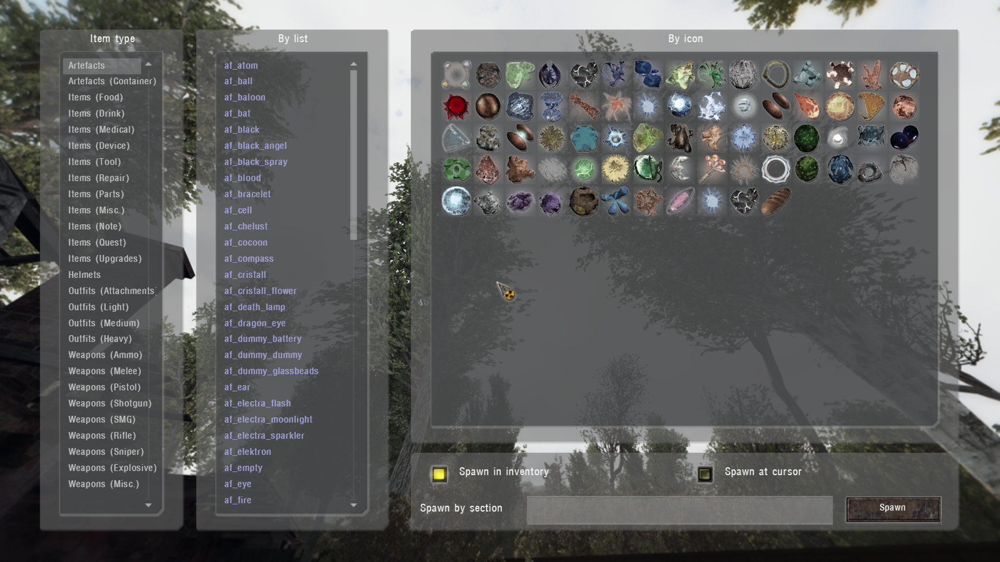

# Item Spawner

___

## General information

In this spawner you can spawn all item sections for the player

In the left column, select the type of item

Further the item can be `selected in the list of sections` or `by clicking on the item icon`

Below there is a line with a choice of spawning: `in the inventory` or at the `place of the aiming cursor`

The item can also be spawned `by typing the name of the item's section` in the line

___

## Technical part

Items appear in the list because of the "`kind`" or `engine class` parameter in their [*.ltx](../../reference/file-formats/conf-script/ltx.md) file. The spawner script can be found in the file "`ui_debug_main.script`"

`Full list`

| Name | Technical type (kind or Engine Class) name |
|---|---|
| Artifacts | <abbr title="kind">i_arty</abbr> <abbr title="kind">i_arty_junk</abbr> <abbr title="Engine Class">ARTEFACT SCRPTART</abbr> |
| Artifacts (Container) | <abbr title="kind">i_arty_cont</abbr> |
| Items (Food) | <abbr title="kind">i_mutant_cooked</abbr> <abbr title="kind">i_mutant_raw</abbr> <abbr title="kind">i_food</abbr> <abbr title="Engine Class">II_FOOD S_FOOD |
| Items (Drink) | <abbr title="kind">i_drink</abbr> <abbr title="Engine Class">II_BOTTL |
| Items (Medical) | <abbr title="kind">i_medical</abbr> <abbr title="Engine Class">II_BANDG II_MEDKI II_ANTIR |
| Items (Device) | <abbr title="kind">i_device</abbr> <abbr title="Engine Class">DET_SIMP DET_ADVA DET_ELIT DET_SCIE |
| Items (Tools) | <abbr title="kind">i_kit</abbr> <abbr title="kind">i_tool</abbr> |
| Items (Repair) | <abbr title="kind">i_repair</abbr> |
| Items (Parts) | <abbr title="kind">i_part</abbr> |
| Items (Mics.) | <abbr title="kind">i_mutant_part</abbr> <abbr title="kind">i_misc</abbr> <abbr title="Engine Class">II_DOC EQ_PATCH II_ATTCH II_BTTCH D_FLALIT S_PDA D_PDA |
| Items (Note) | <abbr title="kind">i_letter</abbr> |
| Items (Quest) | <abbr title="kind">i_quest</abbr> |
| Items (Upgrades) | <abbr title="kind">i_upgrade</abbr> |
| Helmets | <abbr title="kind">o_helmet</abbr> <abbr title="Engine Class">E_HLMET EQU_HLMET |
| Outfits (Attachments) | <abbr title="kind">i_mutant_belt</abbr> <abbr title="kind">i_attach</abbr> <abbr title="kind">i_backpack</abbr> <abbr title="Engine Class">EQ_BAKPK |
| Outfits (Light) | <abbr title="kind">o_light</abbr> |
| Outfits (Medium) | <abbr title="Engine Class">E_STLK EQU_STLK</abbr> <abbr title="kind">o_medium</abbr> <abbr title="kind">o_sci</abbr> |
| Outfits (Heavy) | <abbr title="kind">o_heavy</abbr> |
| Weapons (Ammo) | <abbr title="kind">w_ammo</abbr> <abbr title="Engine Class">AMMO AMMO_S S_OG7B S_VOG25 S_M209</abbr> |
| Weapons (Melee) | <abbr title="kind">w_melee</abbr> <abbr title="Engine Class">WP_KNIFE</abbr> |
| Weapons (Pistol) | <abbr title="kind">w_pistol</abbr><abbr title="Engine Class"> WP_HPSA WP_PM WP_USP45</abbr> |
| Weapons (Shotgun) | <abbr title="kind">w_shotgun</abbr> <abbr title="Engine Class">WP_ASHTG WP_BM16 |
| Weapons (SMG) | <abbr title="kind">w_smg</abbr> |
| Weapons (Rifle) | <abbr title="kind">w_rifle</abbr> <abbr title="Engine Class">WP_AK74 WP_GROZA WP_LR300 WP_VAL</abbr> |
| Weapons (Sniper) | <abbr title="kind">w_sniper</abbr> <abbr title="Engine Class">WP_SVD WP_SVU</abbr> |
| Weapons (Explosive) | <abbr title="kind">w_explosive</abbr><abbr title="Engine Class"> WP_RG6 WP_RPG7 G_F1_S G_RGD5_S G_F1 G_RGD5</abbr> |
| Weapons (Misc.) | <abbr title="kind">w_misc</abbr> <abbr title="Engine Class">WP_SCOPE WP_SILEN WP_GLAUN S_WPN_MISC WP_BINOC II_BOLT</abbr> |
