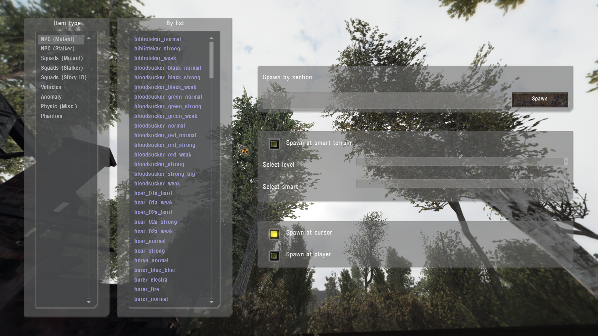

# Object Spawner

___

## General information

Spawns sections of physical objects or living creatures

Similar to [Item Spawner](item-spawner.md) but has its own tools

- `Spawn at smart terrain` - allows you to spawn a selected section at a certain level and [smart terrain](../../glossary/glossary.md#SmartTerrain)
- `Spawn at cursor` - the same as in [Item Spawner](item-spawner.md)
- `Spawn at player` - spawns the selected section directly on the player's coordinates

___

## Technical part

Sections appear in the list because of the specified `engine class` in their [*.ltx](../../reference/file-formats/conf-script/ltx.md) file. The spawner script can be found in the file "`ui_debug_main.script`"

`Full list`

| Name | Engine Class |
|---|---|
| NPC (Mutant) | SM_KAR  SM_BLOOD  SM_BOARW  SM_BURER  SM_CAT_S  SM_CHIMS  SM_CONTR  SM_DOG_S  SM_FLESH  SM_IZLOM  SM_GIANT  SM_POLTR  SM_P_DOG  SM_DOG_P  SM_DOG_F  SM_SNORK  SM_TUSHK  SM_ZOMBI  SM_RAT  SM_KARLIK  SM_LURKER  SM_PSYSUCKER |
| NPC (Stalker) | AI_STL_S  AI_TRD_S |
| Squads (Mutant) | ON_OFF_S |
| Squads (Stalker) | ON_OFF_S |
| Squads (Story ID) | ON_OFF_S |
| Vehicles | C_HLCP_S  C_NIVA  SCRPTCAR |
| Anomaly | ZS_MBALD  ZS_GALAN  ZS_MINCE  ZS_RADIO  ZS_TORRD  ZS_NGRAV  Z_MBALD  Z_RADIO  Z_CFIRE  Z_NOGRAV  Z_TORRID  Z_RUSTYH  ZS_BFUZZ  ZS_AMEBA |
| Physic (Misc.) | O_PHYSIC  O_DSTRBL  O_PHYS_S  O_DSTR_S  S_INVBOX  O_INVBOX  S_EXPLO  II_EXPLO |
| Phantom | AI_PHANT |
