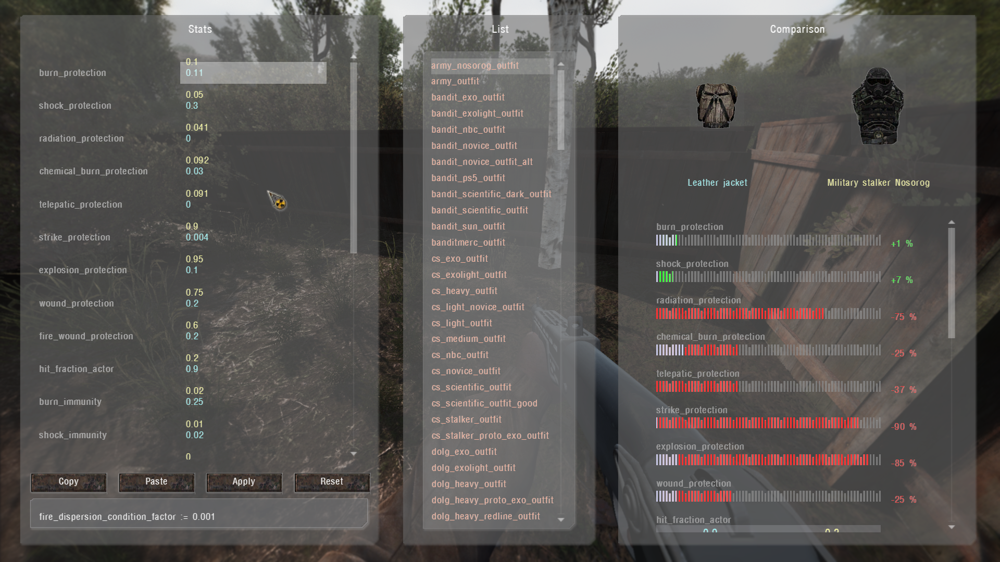

# Outfits/Weapon Stats Editor

___

## General information

Allows you to edit outfit and weapon parameters

> Attention

- Items configs must be unpacked before working with the editor, they must be in (gamedata/configs/items)
- Don't forget to make a backup of the configs for reference.

### Keybinds

- `Arrow keys` - parameters navigation.
- `Numpad 8/2` - increase/reduce selected value.
- `Numpad 9/3` - increase/reduce all values of selected parameter.
- `LShift (hold)` - x10 value step size / jump 2 parameters.
- `LAlt (hold)` - x50 value step size / jump 3 parameters.
- `Numpad 5` - copy current stats.
- `Numpad 6` - paste stored stats.
- `H` - Show help window.
- `Esc` - turn off editor.

To work it is necessary to put on the outfit or weapon to be edited

### Left Colomn

The column on the left shows the items parameters (yellow color highlights the values of the item selected for comparison with the currently worn item)

- `Copy` - copies parameters
- `Paste` - pastes parameters
- `Apply` - applies parameters
- `Reset` - resets the items parameters to their original values (Modified values are cached temporarly for the item you're working on, you can return to it if you turn the editor off)

### Middle Colomn

The column in the middle has items (outfits/weapons) sections for comparison with the current items worn

### Right Colomn

The column on the right shows a comparison of items parameters

___

## Technical part

The editor script is located in the file "`ui_debug_item.script`"
