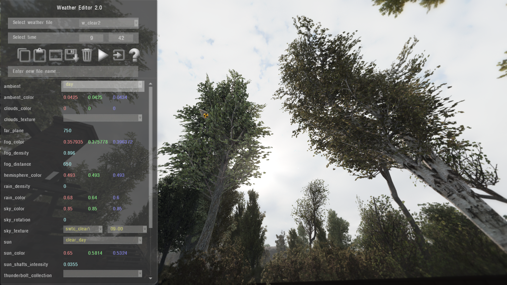
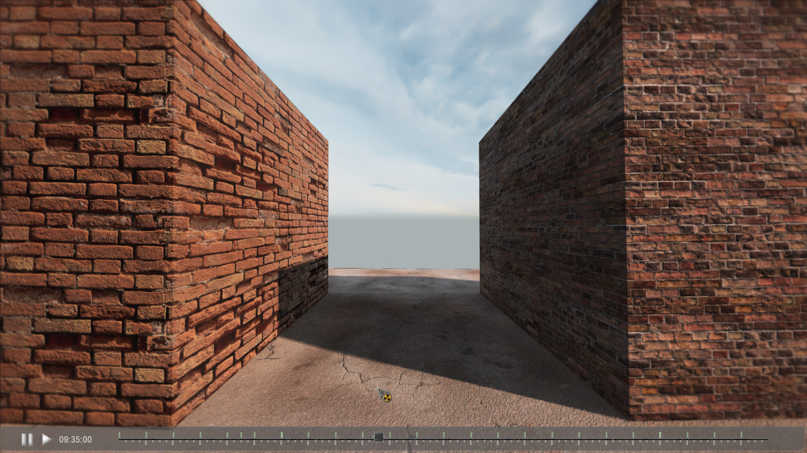

# Weather Editor

___

## General information

Weather editor allows you to change weather values in real-time. Minute precision

- The GUI is interactive and easy to use, with ability to modify or create new weather files
- Edited values are temporary cached for the weathers, hours and minutes you worked on. You can return to them in case you turned off the editor (Avoid exiting or reloading when you have unsaved values)
- In Viewer mode, you can witness weather changes by the time slider

> Viewer Mode

### Key binds

- `Up Arrow` - select previous parameter
- `Down Arrow` - select next parameter
- `Left Arrow` - reduce\rotate value of selected parameter
- `Right Arrow` - increase\rotate value of selected parameter
- `LShift (hold)` - x10 value step
- `LAlt (hold)` - x50 value step
- `Q` - previous hour
- `A` - next hour
- `W` - previous minute
- `S` - next minute
- `E` - increase selected parameter value
- `D` - reduce selected parameter value
- `R` - increase selected group value (all parameters within)
- `F` - reduce selected group value (all parameters within)
- `T` - next moment
- `G` - previous moment
- `C` - copy select parameter value
- `C + CTRL` - copy current moment settings
- `V` - paste/apply copied parameter value
- `V + CTRL` - paste/apply to current moment settings
- `Z` - viewer mode
- `Delete` - Reset current modified moment
- `Delete + CTRL` - Reset all modified moments
- `H` - toggle hint window
- `Esc` or `Home` - turn off editor

### Buttons

| Icon | Description |
|---|:---:|
|  | Copy settings |
|  | Paste settings |
|  | Viewer Mode |
|  | Pause in Viewer Mode |
|  | Auto play in Viewer Mode |
|  | Save to new file if you indicated the name in box below, otherwise save to current file. Name of custom files must start with "`w_`". |
|  | Clear cached values |
|  | Resume weather, and exit |
|  | Exit (weather will still paused in engine) |
|  | About |

___

## Technical part

The settings of the editor and its parameters can be found in the file "`ui_debug_weather.script`"

`Full parameter list`

| Name | Description | Note |
|---|---|---|
| ambient | Ambient | The list is taken from the file "`ambients.ltx`" |
| ambient_color | Ambient Color |  |
| clouds_color | Clouds Color |  |
| clouds_texture | Clouds Texture |  |
| far_plane |  |  |
| fog_color | Fog Color |  |
| fog_density | Fog Density |  |
| fog_distance | Fog Distance |  |
| hemisphere_color | Hemisphere Color |  |
| rain_density | Rain Density |  |
| rain_color | Rain Color |  |
| sky_color | Sky Color |  |
| sky_rotation | Sky Rotation |  |
| sky_texture | Sky Texture |  |
| sun | Sun | The list is taken from the file "`suns.ltx`" |
| sun_color |  |  |
| sun_longitude | Sun Longitude | Unused |
| sun_altitude | Sun Altitude | Unused |
| sun_shafts_intensity | Sun Shaft Intensity |  |
| thunderbolt_collection |  | The list is taken from the file "`thunderbolt_collections.ltx`" |
| thunderbolt_duration | Thunderbolt Duration |  |
| thunderbolt_period | Thunderbolt Period |  |
| water_intensity | Water Intensity |  |
| wind_velocity | Wind Velocity |  |
| tree_amplitude_intensity | Tree Amplitude Intensity |  |
| wind_direction | Wind Direction |  |
