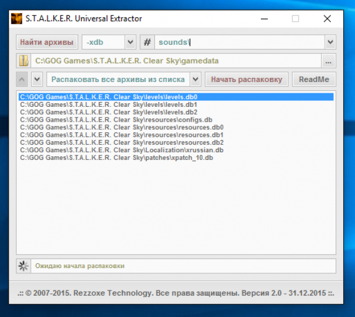
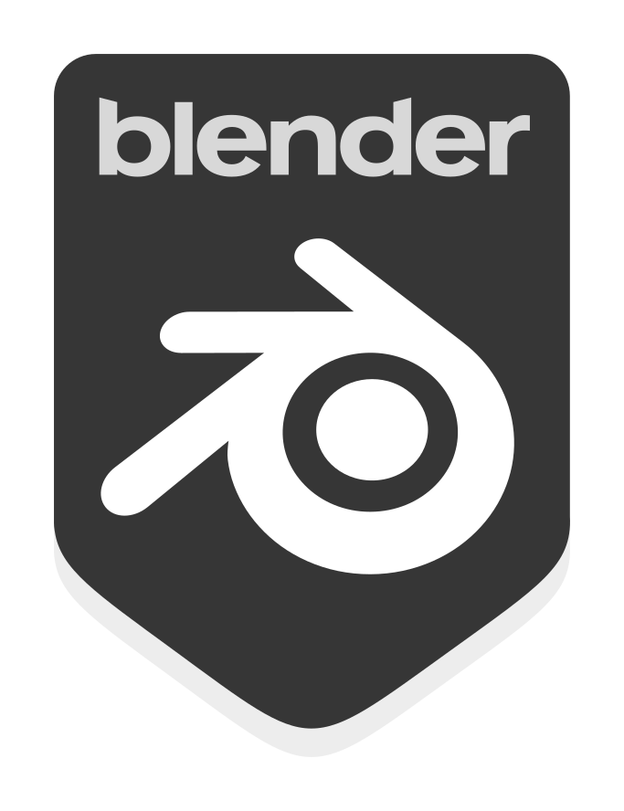

# Modding Tools

## Toolsets

- [AXRToolset](https://github.com/revolucas/AXRToolset) - AXRToolset is an AutoHotkey & Lua-based scripting engine that utilizes a Graphical User Interface to display scripted plugins that do various automated tasks. Although the current plugins are designed to aid in the development of S.T.A.L.K.E.R.: Call of Chernobyl, the engine itself can be used to create macros, scripts and other utilities for any application or purpose.

## Gamedata Extractors

Software to unpack gamedata

- [Universal Extractor 2.0](https://disk.yandex.ru/d/GbgDm-JT2JtfNQ) - Unzips the gamedata from the original trilogy

- db_unpacker.bat (tools/) - Anomaly's internal gamedata extractor, which extracts the scripts and configs files from the .db
- db_unpacker_all.bat (tools/) - An internal gamedata extractor from Anomaly, which extracts all files from .db

## Converters

- converter.exe (tools/) - Converts files from one format to another.

## SDK's

Official SDK with community enhancements:

- SDK 0.4 (Shadows of Chernobyl)

- SDK 0.5/0.6 (Clear Sky)

- [SDK 0.7 (Call of Pripyat)(RePack by DaaGuda V2)](https://mega.nz/folder/zFBiWSAJ#5_MSuGpVPb7QqcPH00nC7w)

    - SDK 0.7 Easy: 
        - The easiest version, but gamedata and rawdata are excluded from its composition, there are no add-ons.
        - For full functionality you will need to unpack gamedata from CoP 1.6.02. 
        - Weight: 22 MB

    - SDK 0.7 Medium(Win32/Win64):
        - The same as Easy, but with rawdata and some additions.
        - Just to work fully need to unpack gamedata from CoP 1.6.02.
        - Weight: 192.4 MB/190.2 MB

    - SDK 0.7 Full(Win32/Win64):
        - The heaviest version, it includes unpacked gamedata, rawdata with sources of CS, CoP objects (excluded objects from rawdata\objects\scenes folder because of its weight)
        - Preinstalled add-ons from other suites. 
        - Weight: 2.64 GB/2.64 
        
- [SDK 0.8 by Red Panda](https://github.com/RedPandaProjects/XRayEngine/releases)- This is a port and a small upgrade of the classic 0.7 editor set. A lot of problems with the classic editor were related to the outdated development environment, which did not allow to upgrade it. Imgui was taken as a UI shell, as the easiest ui allowing to create simple forms with one line of code. All 4 editors were taken over.

- [SDK 2.6 beta (Lost Alpha)](https://www.moddb.com/mods/lost-alpha/downloads/stalker-lostalpha-sdk-v26-beta)

## 3D packages

3D Packages that have compatibility/addons to work with X-Ray:

- [Blender(With X-Ray Addon)](../blender/index.html)

- 3Ds Max

- MilkShape

## Textures

- [OXR Texture Tool](https://github.com/revolucas/OXR-Texture-Tool) - This tools purpose is to unpack ui_icon_equipment.dds into separate individual icons so that they can be manipulated individually or merged more easily. This tool is capable of creating a new sprite sheet using the unpacked icons and writing the new geometry values (w,h,x,y) into the system configs. It also allows you to merge up to 4 existing unpacked ui_icon_equipment directories into a single sheet.

- [THM Editor](https://gitlab.com/i-love-kfc/thm-editor/)
- [THM Editor by Valerok](https://github.com/VaIeroK/THM-Editor)

- [ThmValidator](https://github.com/gunslingermod/ThmValidator) - Allows you to check the THM files in the selected directory and automatically fix the most common bugs that occur during manual editing.

- [Substance 3D Painter](https://store.steampowered.com/app/1775390/Substance_3D_Painter_2022/)

- [Paint.net](https://www.getpaint.net/) - Most often used to properly compress textures

## Animations

- [OMF Editor](https://github.com/mortany/omf_editor)
- [OMF Editor by Valerok](https://github.com/VaIeroK/Omf-Editor)

## Models

- [OGF Editor](https://github.com/mortany/OGF-tool)
- [OGF Editor by Valerok](https://github.com/VaIeroK/OGF-tool)

- [MeshToolz](https://github.com/gunslingermod/MeshToolz) - Swiss knife for low-level editing of OGF models. Want to copy a piece of one model to another? Easy. Change texture paths and bindings? No problem. Move and scale an item by snapping it to another bone? No problem. Can work both interactively and in script processing mode.
    - [Scripts For MeshToolz](https://github.com/gunslingermod/additional_scopes)

- [OGFViewer](https://www34.zippyshare.com/v/EvcVDW8S/file.html)

- [ObjectParamsCopier](https://github.com/gunslingermod/ObjectParamsCopier) -  Allows you to quickly copy surface settings with the same name from one object file to another

- [OgfRefEditor](https://github.com/gunslingermod/OgfRefEditor) - Editor of the list of OMFs connected to the model. It is intended primarily for changing the list of OMFs used in hand models, for this purpose it is possible to apply the OMF list to all OGFs in the selected folder

- [BumpGenerator](https://github.com/gunslingermod/BumpGenerator) - Intended for DXT compression of bumps together with simultaneous generation of bump#maps (the purpose of which is to correct errors introduced by compression). It works similarly to a similar function in KFK. As input textures, both standard ("blue") bump textures and bump textures used directly in the game with rearranged channels are supported.

- [StalkerWeaponToolKit](https://disk.yandex.ru/d/x3771W3btrwtFw) - Tool for working with weapons

## Upgrades

- [Upgrades Editor](https://github.com/gunslingermod/upgrades_editor)

## NPC's

- [NPC creator](https://disk.yandex.ru/d/kQnkCrVdtW8clQ)

## AI

- [Decompressor of .efd files](https://cdn.discordapp.com/attachments/385903500581928969/590555274079633408/EFD_Reader.7z)

## Decompilers

- [ACDC](https://disk.yandex.ru/d/4BEMg9aicjYhy) - Perl script, to unpack and pack all.spawn
    - The program requires Perl to be installed.
    - You also need [stkutils](https://disk.yandex.ru/d/nnjntzYZQv8sD) (put it in the folder with the script or in C:\Perl\lib)

## Compilers

- [Universal x64 level compilers](https://drive.google.com/file/d/1ZR8bnMkTGqFiZgGE7DtHCRYfSgj0GrPz/view)

## Compression

.db/.xdb archiver

- [DB_Compressor by d_μaμ](https://cdn.discordapp.com/attachments/616764067670917131/846799604438532107/DB_Compressor.rar)
- [xrCompress](https://ap-pro.ru/forums/topic/3500-obnovlyonnyy-xrcompress/)