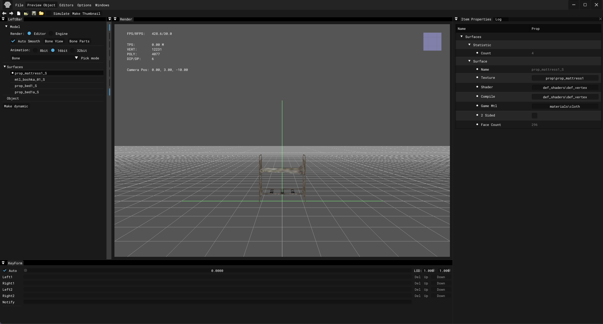

# Actor Editor

___

## About

The Actor editor is usually needed to customize objects (NPCs, Objects, etc.)

___

### File Button

| Button | Description | Note |
|---|---|---|
| Clear | Clears scene | - |
| Load | Loads an object into a new scene | - |
| Save | Saves object | - |
| Save as... | Saves the object as | [.object](../../../reference/file-formats/models/object.md)  .lwo  |
| Open Recent | Opens recent | - |
| Import... | Imports the model into the scene | - |
| Optimize Motions |  |  |
| Batch Convert... |  |  |
| Export | Exports the model to formats  | [.ogf](../../../reference/file-formats/models/ogf.md)  [.omf](../../../reference/file-formats/animations/omf.md)  [.obj](../../../reference/file-formats/models/object.md)  [.dm](../../../reference/file-formats/models/dm.md) C++ |
| Quit | Exiting the program | - |

### Preview Object

| Button | Description |
|---|---|
| Custom... |  |
| Clear |  |
| Preference |  |

### Editor

<table><thead>
  <tr>
    <th>Option</th>
    <th>Option</th>
    <th></th>
    <th>Description</th>
  </tr></thead>
<tbody>
  <tr>
    <td rowspan="8">Editors</td>
    <td rowspan="3">Image</td>
    <td>Image Editor</td>
    <td></td>
  </tr>
  <tr>
    <td>Synchronize Textures</td>
    <td></td>
  </tr>
  <tr>
    <td>Check New Textures</td>
    <td></td>
  </tr>
  <tr>
    <td rowspan="3">Sounds</td>
    <td>Sound Editor</td>
    <td></td>
  </tr>
  <tr>
    <td>Synchronize Sounds (Soft)</td>
    <td></td>
  </tr>
  <tr>
    <td>Synchronize Sounds (Hard)</td>
    <td></td>
  </tr>
  <tr>
    <td>Light Anim Editor</td>
    <td>-</td>
    <td></td>
  </tr>
  <tr>
    <td>Minimap Editor</td>
    <td>-</td>
    <td></td>
  </tr>
</tbody>
</table>

### Options

<table><thead>
  <tr>
    <th>Button</th>
    <th>Options</th>
    <th></th>
    <th>Description</th>
    <th></th>
    <th>Description</th>
  </tr></thead>
<tbody>
  <tr>
    <td rowspan="20">Options</td>
    <td rowspan="10">Render</td>
    <td>Quality</td>
    <td></td>
    <td></td>
    <td></td>
  </tr>
  <tr>
    <td rowspan="3">Fill Mode</td>
    <td rowspan="3"></td>
    <td>Point</td>
    <td></td>
  </tr>
  <tr>
    <td>Wireframe</td>
    <td></td>
  </tr>
  <tr>
    <td>Solid</td>
    <td></td>
  </tr>
  <tr>
    <td rowspan="2">Shader Mode</td>
    <td rowspan="2"></td>
    <td>Flat</td>
    <td></td>
  </tr>
  <tr>
    <td>Gouraud</td>
    <td></td>
  </tr>
  <tr>
    <td>Edged Faces</td>
    <td></td>
    <td></td>
    <td></td>
  </tr>
  <tr>
    <td>RenderHW</td>
    <td></td>
    <td></td>
    <td></td>
  </tr>
  <tr>
    <td>Filter Linear</td>
    <td></td>
    <td></td>
    <td></td>
  </tr>
  <tr>
    <td>Textures</td>
    <td></td>
    <td></td>
    <td></td>
  </tr>
  <tr>
    <td>Draw Safe Rect</td>
    <td></td>
    <td></td>
    <td></td>
    <td></td>
  </tr>
  <tr>
    <td>Draw Grid</td>
    <td></td>
    <td></td>
    <td></td>
    <td></td>
  </tr>
  <tr>
    <td rowspan="3">Coordinate Axes</td>
    <td>None</td>
    <td></td>
    <td></td>
    <td></td>
  </tr>
  <tr>
    <td>Axis</td>
    <td></td>
    <td></td>
    <td></td>
  </tr>
  <tr>
    <td>Cube</td>
    <td></td>
    <td></td>
    <td></td>
  </tr>
  <tr>
    <td>Fog</td>
    <td></td>
    <td></td>
    <td></td>
    <td></td>
  </tr>
  <tr>
    <td>Mute Sounds</td>
    <td></td>
    <td></td>
    <td></td>
    <td></td>
  </tr>
  <tr>
    <td>Real Time</td>
    <td></td>
    <td></td>
    <td></td>
    <td></td>
  </tr>
  <tr>
    <td>Stats</td>
    <td></td>
    <td></td>
    <td></td>
    <td></td>
  </tr>
  <tr>
    <td>Preferences</td>
    <td></td>
    <td></td>
    <td></td>
    <td></td>
  </tr>
</tbody></table>

### Windows

| Button | Description |
|---|---|
| Log |  |
| Post Process |  |
| Theme |  |

### Top Bar

| Icon | Name | Description |
|---|---|---|
|  | Undo | Undo the last action |
|  | Redo | Repeat the last action |
|  | New | Clear/New Scene |
|  | Open | Open file |
|  | Save | Save file |
|  | Open | Open "gamedata" folder |
|  | Simulate | Activates physics simulation |
