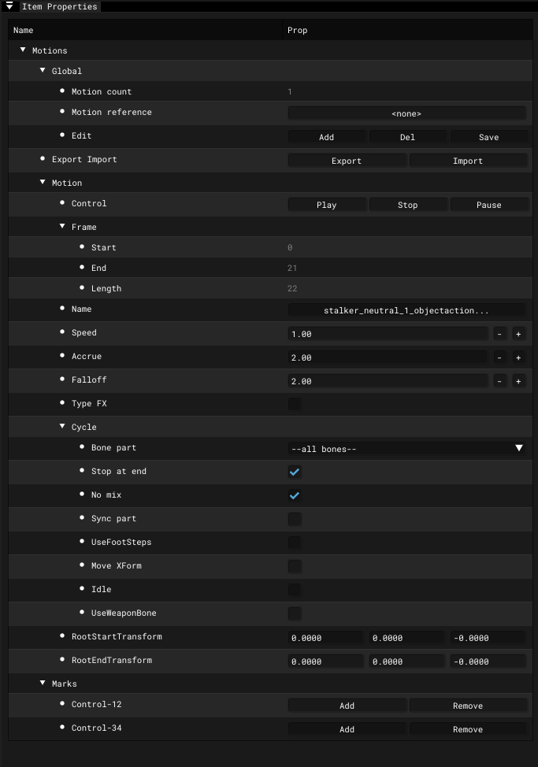

# Actor Editor - Item Properties - Motions

___

## About

### Global

| 1 | 2 |
|---|---|
| Motion count | Motion count |
| Motion Reference | Motion Reference |
| Edit |  |

### Motions

| 1 | 2 |
|---|---|
| Control |  |
| Name |  |
| Speed |  |
| Accrue |  |
| Falloff |  |
| RootStartTransform |  |
| RootEndTransform |  |

#### Frame

| 1 | 2 |
|---|---|
| Start |  |
| End |  |
| Length |  |

#### Cycle

| 1 | 2 |
|---|---|
| Bone part | 1 |
| Stop at end |  |
| No mix |  |
| Sync part |  |
| UseFootSteps |  |
| Move XForm |  |
| Idle |  |
| UseWeaponBone |  |

#### Marks

| 1 | 2 |
|---|---|
| Control-12 | 1 |
| Control-34 | 2 |
