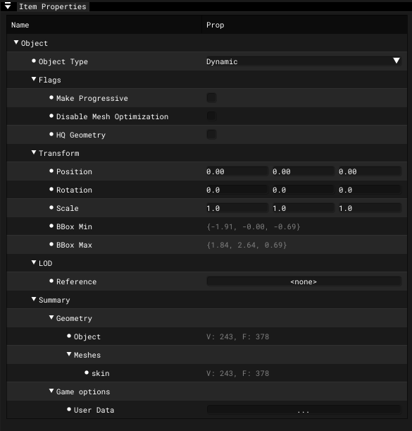

# Actor Editor - Item Properties - Object

___

## Object

| Name | Description |
|---|---|
| Object Type |  |

### Flags

| Name | Description |
|---|---|
| Make Progressive |  |
| Disable Mesh Oprimization |  |
| HQ Geometry |  |

### Transform

| Name | Description |
|---|---|
| Position |  |
| Rotation |  |
| Scale |  |
| BBox Min |  |
| BBox Max |  |

### LOD

| Name | Description |
|---|---|
| Reference |  |

### Summary

#### Geometry

| Name | Description |
|---|---|
| Objects |  |
| Meshes |  |

#### Game Options

| Name | Description |
|---|---|
| User Data |  |
