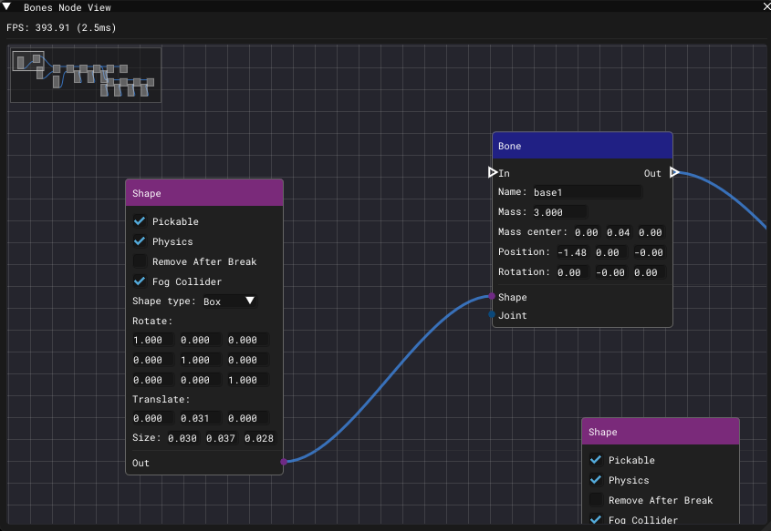

# Bone Node View Window

___

## About

### Bone Node

| Socket | Description |
|---|---|
| In |  |
| Out |  |
| Name | Bone name |
| Mass | Bone mass |
| Mass Center | Bone center of mass |
| Position | Bone position |
| Rotation | Bone rotation |
| Shape | Bone shape |
| Joint | Bone joint |

### Shape Node

| Socket | Description |
|---|---|
| Pickable |  |
| Physics |  |
| Remove After Break |  |
| Fog Collider |  |
| Shape Type |  |
| Rotate |  |
| Translate |  |
| Size |  |
| Out |  |
