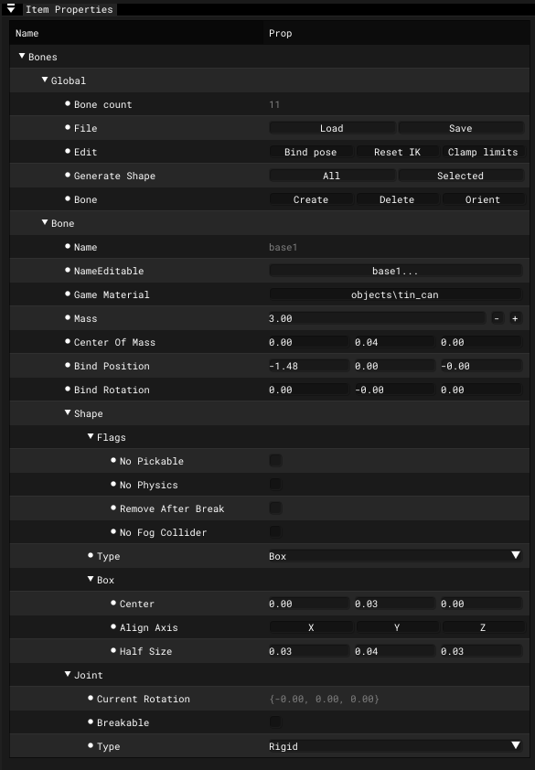

# Actor Editor - Item Properties Window

___

## About

<body>
  <link rel="stylesheet" href="tables.css">
  
  

    

      <button class="tab-button active" onclick="openTable(event, 'Bones')">Bones</button>
      <button class="tab-button" onclick="openTable(event, 'Motions')">Motions</button>
      <button class="tab-button" onclick="openTable(event, 'Object')">Object</button>
      <button class="tab-button" onclick="openTable(event, 'Surfaces')">Surfaces</button>
    

    

      <table>
        <thead>
        <tr>
          <th>Group</th>
          <th></th>
          <th>Description</th>
          <th>Extra</th>
          <th>Description</th>
          <th>Extra</th>
          <th>Description</th>
        </tr></thead>
      <tbody>
        <tr>
          <td rowspan="11">Global</td>
          <td>Bone Count</td>
          <td></td>
          <td>-</td>
          <td>-</td>
          <td>-</td>
          <td>-</td>
        </tr>
        <tr>
          <td rowspan="2">File</td>
          <td rowspan="2"></td>
          <td>Load</td>
          <td></td>
          <td>-</td>
          <td>-</td>
        </tr>
        <tr>
          <td>Save</td>
          <td></td>
          <td>-</td>
          <td>-</td>
        </tr>
        <tr>
          <td rowspan="3">Edit</td>
          <td rowspan="3"></td>
          <td>Bind Pose</td>
          <td>Resets the transformations of all bones</td>
          <td>-</td>
          <td>-</td>
        </tr>
        <tr>
          <td>Reset IK</td>
          <td>Resets additional bone parameters to default values (IK parameters, bone game material, bone shape, mass and center of mass)</td>
          <td>-</td>
          <td>-</td>
        </tr>
        <tr>
          <td>Clamp Limits</td>
          <td></td>
          <td>-</td>
          <td>-</td>
        </tr>
        <tr>
          <td rowspan="2">Generate Shape</td>
          <td rowspan="2">Generates collisional shapes for skeletal bones based on mesh vertices</td>
          <td>All</td>
          <td>Generate collision shapes for all bones</td>
          <td>-</td>
          <td>-</td>
        </tr>
        <tr>
          <td>Selected</td>
          <td>Generate collision shapes for selected bones</td>
          <td>-</td>
          <td>-</td>
        </tr>
        <tr>
          <td rowspan="3">Bone</td>
          <td rowspan="3"></td>
          <td>Create</td>
          <td>Create new bone</td>
          <td>-</td>
          <td>-</td>
        </tr>
        <tr>
          <td>Delete</td>
          <td>Delete selected bone</td>
          <td>-</td>
          <td>-</td>
        </tr>
        <tr>
          <td>Orient</td>
          <td></td>
          <td>-</td>
          <td>-</td>
        </tr>
        <tr>
          <td rowspan="33">Bone</td>
          <td>Name</td>
          <td>Bone name</td>
          <td>-</td>
          <td>-</td>
          <td>-</td>
          <td>-</td>
        </tr>
        <tr>
          <td>NameEditable</td>
          <td>Editable bone name</td>
          <td>-</td>
          <td>-</td>
          <td>-</td>
          <td>-</td>
        </tr>
        <tr>
          <td>Game Material</td>
          <td>Game material</td>
          <td>-</td>
          <td>-</td>
          <td>-</td>
          <td>-</td>
        </tr>
        <tr>
          <td>Mass</td>
          <td>Bone mass</td>
          <td>-</td>
          <td>-</td>
          <td>-</td>
          <td>-</td>
        </tr>
        <tr>
          <td>Center Of Mass</td>
          <td>Bone center of mass</td>
          <td>-</td>
          <td>-</td>
          <td>-</td>
          <td>-</td>
        </tr>
        <tr>
          <td>Bind Position</td>
          <td>Bone bind position</td>
          <td>-</td>
          <td>-</td>
          <td>-</td>
          <td>-</td>
        </tr>
        <tr>
          <td>Bind Rotation</td>
          <td>Bone bind rotation</td>
          <td>-</td>
          <td>-</td>
          <td>-</td>
          <td>-</td>
        </tr>
        <tr>
          <td rowspan="7">Shape</td>
          <td rowspan="7"></td>
          <td rowspan="4">Flags</td>
          <td rowspan="4"></td>
          <td>No Pickable</td>
          <td></td>
        </tr>
        <tr>
          <td>No Physics</td>
          <td></td>
        </tr>
        <tr>
          <td>Remove After Break</td>
          <td></td>
        </tr>
        <tr>
          <td>No Fog Collider</td>
          <td></td>
        </tr>
        <tr>
          <td rowspan="3">Type</td>
          <td rowspan="3"></td>
          <td>Box</td>
          <td></td>
        </tr>
        <tr>
          <td>Sphere</td>
          <td></td>
        </tr>
        <tr>
          <td>Cylinder</td>
          <td></td>
        </tr>
        <tr>
          <td rowspan="19">Joint</td>
          <td rowspan="19"></td>
          <td>Current Rotation</td>
          <td></td>
          <td>-</td>
          <td>-</td>
        </tr>
        <tr>
          <td>Breakable</td>
          <td></td>
          <td>-</td>
          <td>-</td>
        </tr>
        <tr>
          <td>Break Force</td>
          <td></td>
          <td>-</td>
          <td>-</td>
        </tr>
        <tr>
          <td>Break Torque</td>
          <td></td>
          <td>-</td>
          <td>-</td>
        </tr>
        <tr>
          <td rowspan="5">Type</td>
          <td rowspan="5"></td>
          <td>Rigid</td>
          <td></td>
        </tr>
        <tr>
          <td>Cloth</td>
          <td></td>
        </tr>
        <tr>
          <td>Joint</td>
          <td></td>
        </tr>
        <tr>
          <td>Wheel [Steer-X/Roll-Z]</td>
          <td></td>
        </tr>
        <tr>
          <td>Slider</td>
          <td></td>
        </tr>
        <tr>
          <td>Friction</td>
          <td></td>
          <td>-</td>
          <td>-</td>
        </tr>
        <tr>
          <td>Spring Factor</td>
          <td></td>
          <td>-</td>
          <td>-</td>
        </tr>
        <tr>
          <td>Damping Factor</td>
          <td></td>
          <td>-</td>
          <td>-</td>
        </tr>
        <tr>
          <td rowspan="3">Limits</td>
          <td rowspan="3"></td>
          <td>Axis X</td>
          <td></td>
        </tr>
        <tr>
          <td>Axis Y</td>
          <td></td>
        </tr>
        <tr>
          <td>Axis Z</td>
          <td></td>
        </tr>
        <tr>
          <td rowspan="2">Steer</td>
          <td rowspan="2"></td>
          <td>Limits Min</td>
          <td></td>
        </tr>
        <tr>
          <td>Limits Max</td>
          <td></td>
        </tr>
        <tr>
          <td>Slide (Axis Z)</td>
          <td></td>
          <td>-</td>
          <td>-</td>
        </tr>
        <tr>
          <td>Rotate (Axis Z)</td>
          <td></td>
          <td>-</td>
          <td>-</td>
        </tr>
      </tbody>
      </table>
    

    

    <table><thead>
  <tr>
    <th>Group</th>
    <th></th>
    <th>Description</th>
    <th>Extra</th>
    <th>Extra Description</th>
  </tr></thead>
<tbody>
  <tr>
    <td rowspan="7">Global</td>
    <td>Motion Count</td>
    <td>Motion count</td>
    <td>-</td>
    <td>-</td>
  </tr>
  <tr>
    <td>Motion Reference</td>
    <td>Adds Motion Reference</td>
    <td>-</td>
    <td>-</td>
  </tr>
  <tr>
    <td rowspan="3">Edit</td>
    <td rowspan="3"></td>
    <td>Add</td>
    <td>Adds selected animations to the list</td>
  </tr>
  <tr>
    <td>Del</td>
    <td>Deletes the selected animation</td>
  </tr>
  <tr>
    <td>Save</td>
    <td>Saves all or only selected animations to a *.skl file</td>
  </tr>
  <tr>
    <td rowspan="2">Export Import</td>
    <td rowspan="2"></td>
    <td>Export</td>
    <td></td>
  </tr>
  <tr>
    <td>Import</td>
    <td></td>
  </tr>
  <tr>
    <td rowspan="23">Motion</td>
    <td rowspan="3">Control</td>
    <td rowspan="3">Animations control</td>
    <td>Play</td>
    <td>Play</td>
  </tr>
  <tr>
    <td>Stop</td>
    <td>Stop</td>
  </tr>
  <tr>
    <td>Pause</td>
    <td>Pause</td>
  </tr>
  <tr>
    <td rowspan="3">Frame</td>
    <td rowspan="3"></td>
    <td>Start</td>
    <td>Start frame</td>
  </tr>
  <tr>
    <td>Stop</td>
    <td>Stop frame</td>
  </tr>
  <tr>
    <td>Length</td>
    <td>Animation frame length</td>
  </tr>
  <tr>
    <td>Name</td>
    <td>Animation name</td>
    <td>-</td>
    <td>-</td>
  </tr>
  <tr>
    <td>Speed</td>
    <td>Animation speed</td>
    <td>-</td>
    <td>-</td>
  </tr>
  <tr>
    <td>Accrue</td>
    <td></td>
    <td>-</td>
    <td>-</td>
  </tr>
  <tr>
    <td>Falloff</td>
    <td></td>
    <td>-</td>
    <td>-</td>
  </tr>
  <tr>
    <td>Type FX</td>
    <td></td>
    <td>-</td>
    <td>-</td>
  </tr>
  <tr>
    <td rowspan="8">Cycle</td>
    <td rowspan="8"></td>
    <td>Bone Part</td>
    <td></td>
  </tr>
  <tr>
    <td>Stop At End</td>
    <td></td>
  </tr>
  <tr>
    <td>No Mix</td>
    <td></td>
  </tr>
  <tr>
    <td>Sync Part</td>
    <td></td>
  </tr>
  <tr>
    <td>UseFootSteps</td>
    <td></td>
  </tr>
  <tr>
    <td>Move XForm</td>
    <td></td>
  </tr>
  <tr>
    <td>Idle</td>
    <td></td>
  </tr>
  <tr>
    <td>UseWeaponBone</td>
    <td></td>
  </tr>
  <tr>
    <td rowspan="2">FX</td>
    <td rowspan="2"></td>
    <td>Start Bone</td>
    <td></td>
  </tr>
  <tr>
    <td>Power</td>
    <td></td>
  </tr>
  <tr>
    <td>RootStartTransform</td>
    <td></td>
    <td>-</td>
    <td>-</td>
  </tr>
  <tr>
    <td>RootEndTransform</td>
    <td></td>
    <td>-</td>
    <td>-</td>
  </tr>
  <tr>
    <td rowspan="4">Marks</td>
    <td rowspan="2">Control-12</td>
    <td rowspan="2"></td>
    <td>Add</td>
    <td></td>
  </tr>
  <tr>
    <td>Remove</td>
    <td></td>
  </tr>
  <tr>
    <td rowspan="2">Control-34</td>
    <td rowspan="2"></td>
    <td>Add</td>
    <td></td>
  </tr>
  <tr>
    <td>Remove</td>
    <td></td>
  </tr>
</tbody></table>
    

    

<table><thead>
  <tr>
    <th></th>
    <th>Description</th>
    <th>Extra</th>
    <th>Extra Description</th>
    <th>Extra</th>
    <th>Extra Description</th>
  </tr></thead>
<tbody>
  <tr>
    <td rowspan="5">Object Type</td>
    <td rowspan="5"></td>
    <td>Static</td>
    <td></td>
    <td></td>
    <td></td>
  </tr>
  <tr>
    <td>Dynamic</td>
    <td></td>
    <td></td>
    <td></td>
  </tr>
  <tr>
    <td>HOM</td>
    <td></td>
    <td></td>
    <td></td>
  </tr>
  <tr>
    <td>Multiply Usage</td>
    <td></td>
    <td></td>
    <td></td>
  </tr>
  <tr>
    <td>Sound Occluder</td>
    <td></td>
    <td></td>
    <td></td>
  </tr>
  <tr>
    <td rowspan="4">Flags</td>
    <td rowspan="4"></td>
    <td>Make Progressive</td>
    <td>Only for Dynamic Object Type</td>
    <td></td>
    <td></td>
  </tr>
  <tr>
    <td>Disable Mesh Optimization</td>
    <td>If not disabled, it optimizes the mesh by removing unnecessary edges and vertices, reallocating memory and updating linked data structures. Only for Dynamic Object Type</td>
    <td></td>
    <td></td>
  </tr>
  <tr>
    <td>HQ Geometry</td>
    <td>Only for Dynamic Object Type</td>
    <td></td>
    <td></td>
  </tr>
  <tr>
    <td>Using LOD</td>
    <td>Only for Multiply Usage Object Type</td>
    <td></td>
    <td></td>
  </tr>
  <tr>
    <td rowspan="5">Transform</td>
    <td rowspan="5"></td>
    <td>Position</td>
    <td>Object position</td>
    <td></td>
    <td></td>
  </tr>
  <tr>
    <td>Rotation</td>
    <td>Object rotation</td>
    <td></td>
    <td></td>
  </tr>
  <tr>
    <td>Scale</td>
    <td>Object scale</td>
    <td></td>
    <td></td>
  </tr>
  <tr>
    <td>BBox Min</td>
    <td>Object Bounding Box Min</td>
    <td></td>
    <td></td>
  </tr>
  <tr>
    <td>BBox Max</td>
    <td>Object <a href="https://en.wikipedia.org/wiki/Minimum_bounding_box">Bounding Box</a> Max</td>
    <td></td>
    <td></td>
  </tr>
  <tr>
    <td rowspan="3">LOD</td>
    <td rowspan="3"></td>
    <td>Reference</td>
    <td>LOD reference</td>
    <td></td>
    <td></td>
  </tr>
  <tr>
    <td rowspan="2">Action</td>
    <td rowspan="2">Only for Multiply Usage Object Type</td>
    <td>Make HQ</td>
    <td></td>
  </tr>
  <tr>
    <td>Make LQ</td>
    <td></td>
  </tr>
  <tr>
    <td rowspan="3">Summary</td>
    <td rowspan="3"></td>
    <td rowspan="2">Geometry</td>
    <td rowspan="2"></td>
    <td>Object</td>
    <td>Objects vertex and face count</td>
  </tr>
  <tr>
    <td>Meshes</td>
    <td>Meshes vertex and face count</td>
  </tr>
  <tr>
    <td>Game Options</td>
    <td></td>
    <td>User Data</td>
    <td>User data</td>
  </tr>
</tbody></table>
    

    

    <table><thead>
  <tr>
    <th>Button</th>
    <th>Description</th>
  </tr></thead>
<tbody>
  <tr>
    <td>Name</td>
    <td>Surface Name</td>
  </tr>
  <tr>
    <td>Texture</td>
    <td>Texture</td>
  </tr>
  <tr>
    <td>Shader</td>
    <td>Engine Shader</td>
  </tr>
  <tr>
    <td>Compile</td>
    <td>Compile Shader</td>
  </tr>
  <tr>
    <td>Game Mtl</td>
    <td>Game Material</td>
  </tr>
  <tr>
    <td>2 Sided</td>
    <td>Face Count</td>
  </tr>
  <tr>
    <td>Face Count</td>
    <td>Face Count</td>
  </tr>
</tbody>
</table>
    

  

</body>
