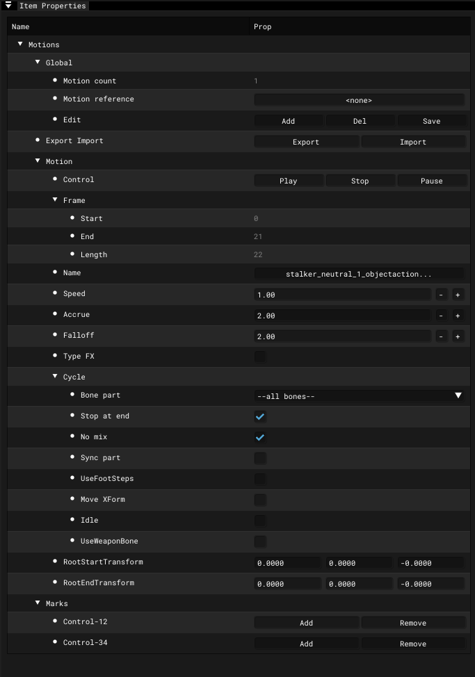

# Actor Editor - Item Properties - Motions

___

## About

### Global

<table><thead>
  <tr>
    <th></th>
    <th>Description</th>
    <th>Extra</th>
    <th>Extra Description</th>
  </tr></thead>
<tbody>
  <tr>
    <td>Motion Count</td>
    <td>Motion сount</td>
    <td>-</td>
    <td>-</td>
  </tr>
  <tr>
    <td>Motion Reference</td>
    <td>Adds Motion Reference</td>
    <td>-</td>
    <td>-</td>
  </tr>
  <tr>
    <td rowspan="3">Edit</td>
    <td rowspan="3"></td>
    <td>Add</td>
    <td>Adds selected animations to the list</td>
  </tr>
  <tr>
    <td>Del</td>
    <td>Deletes the selected animation</td>
  </tr>
  <tr>
    <td>Save</td>
    <td>Saves all or only selected animations to a *.skl file</td>
  </tr>
</tbody>
</table>

### Motion

<table><thead>
  <tr>
    <th></th>
    <th>Description</th>
    <th></th>
    <th>Description</th>
  </tr></thead>
<tbody>
  <tr>
    <td rowspan="3">Control</td>
    <td rowspan="3">Animations control</td>
    <td>Play</td>
    <td>Play</td>
  </tr>
  <tr>
    <td>Stop</td>
    <td>Stop</td>
  </tr>
  <tr>
    <td>Pause</td>
    <td>Pause</td>
  </tr>
  <tr>
    <td rowspan="3">Frame</td>
    <td rowspan="3"></td>
    <td>Start</td>
    <td>Start frame</td>
  </tr>
  <tr>
    <td>Stop</td>
    <td>Stop frame</td>
  </tr>
  <tr>
    <td>Length</td>
    <td>Animation frame length</td>
  </tr>
  <tr>
    <td>Name</td>
    <td>Animation name</td>
    <td>-</td>
    <td>-</td>
  </tr>
  <tr>
    <td>Speed</td>
    <td>Animation speed</td>
    <td>-</td>
    <td>-</td>
  </tr>
  <tr>
    <td>Accrue</td>
    <td></td>
    <td>-</td>
    <td>-</td>
  </tr>
  <tr>
    <td>Falloff</td>
    <td></td>
    <td>-</td>
    <td>-</td>
  </tr>
  <tr>
    <td>Type FX</td>
    <td></td>
    <td>-</td>
    <td>-</td>
  </tr>
  <tr>
    <td rowspan="8">Cycle</td>
    <td rowspan="8"></td>
    <td>Bone Part</td>
    <td></td>
  </tr>
  <tr>
    <td>Stop At End</td>
    <td></td>
  </tr>
  <tr>
    <td>No Mix</td>
    <td></td>
  </tr>
  <tr>
    <td>Sync Part</td>
    <td></td>
  </tr>
  <tr>
    <td>UseFootSteps</td>
    <td></td>
  </tr>
  <tr>
    <td>Move XForm</td>
    <td></td>
  </tr>
  <tr>
    <td>Idle</td>
    <td></td>
  </tr>
  <tr>
    <td>UseWeaponBone</td>
    <td></td>
  </tr>
  <tr>
    <td rowspan="2">FX</td>
    <td rowspan="2"></td>
    <td>Start Bone</td>
    <td></td>
  </tr>
  <tr>
    <td>Power</td>
    <td></td>
  </tr>
  <tr>
    <td>RootStartTransform</td>
    <td></td>
    <td></td>
    <td></td>
  </tr>
  <tr>
    <td>RootEndTransform</td>
    <td></td>
    <td></td>
    <td></td>
  </tr>
</tbody></table>

### Marks

| 1 | 2 |
|---|---|
| Control-12 | 1 |
| Control-34 | 2 |
