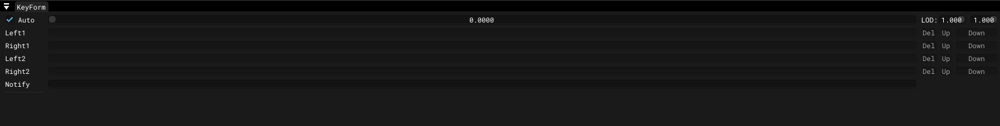

# Key Form Window

___

## About

|  |  |
|---|---|
| Auto | Automatic animation playback |
| Left1 | creates a motion mark named Left |
| Right1 | creates a motion mark named Right |
| Left2 | creates a motion mark named Left2 |
| Right2 | creates a motion mark named Right2 |
| LOD | first value - Model LOD?   Second value - Animation speed multiplier |
| Del | Deletes the mark in the current frame |
| Up | Shifts the end of the mark to the current time |
| Down | Shifts the start of the mark to the current time |
