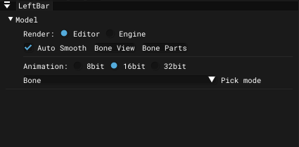

# Actor Editor - Left Bar

___

## About

## Interface

### Model

<table><thead>
  <tr>
    <th></th>
    <th>Description</th>
    <th></th>
    <th>Description</th>
  </tr></thead>
<tbody>
  <tr>
    <td rowspan="2">Render</td>
    <td rowspan="2"></td>
    <td>Editor</td>
    <td></td>
  </tr>
  <tr>
    <td>Engine</td>
    <td></td>
  </tr>
  <tr>
    <td>Auto Smooth</td>
    <td></td>
    <td>-</td>
    <td>-</td>
  </tr>
  <tr>
    <td>Bone View</td>
    <td>Open Bone Node View Window</td>
    <td>-</td>
    <td>-</td>
  </tr>
  <tr>
    <td>Bone Parts</td>
    <td>Open Bone Parts Window</td>
    <td>-</td>
    <td>-</td>
  </tr>
  <tr>
    <td rowspan="3">Animation</td>
    <td rowspan="3"></td>
    <td>8bit</td>
    <td></td>
  </tr>
  <tr>
    <td>16bit</td>
    <td></td>
  </tr>
  <tr>
    <td>32bit</td>
    <td></td>
  </tr>
  <tr>
    <td rowspan="3">Pick mode</td>
    <td rowspan="3"></td>
    <td>None</td>
    <td></td>
  </tr>
  <tr>
    <td>Surface</td>
    <td></td>
  </tr>
  <tr>
    <td>Bone</td>
    <td></td>
  </tr>
</tbody>
</table>

Below will be parts of the model (bones, surfaces, etc.)
