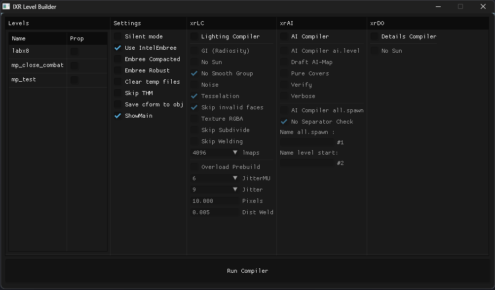

# xrCompiler (IXR Level Builder)

___

## Settings

| Name | Description |
|---|---|
| Silent Mode |  |
| Use IntelEmbree |  |
| Embree Compacted |  |
| Embree Robust |  |
| Clear temp files |  |
| Skip THM |  |
| Save cfrom to obj |  |
| ShowMain |  |

## xrLC

| Name | Description |
|---|---|
| Lightning Compiler |  |
| GI (Radiosity) |  |
| No Sun |  |
| No Smooth Group |  |
| Noise |  |
| Tesselation |  |
| Skip invalid faces |  |
| Texture RGBA |  |
| Skip Subdivide |  |
| Skip Welding |  |
| lmaps |  |
| Overload Prebuild |  |
| JitterMU |  |
| Jitter |  |
| Pixels |  |
| Dist Weld |  |

## xrAI

| Name | Description |
|---|---|
| AI Compiler |  |
| AI Compiler ai.level |  |
| Draft AI-Map |  |
| Pure Covers |  |
| Verify |  |
| Verbose |  |
| AI Compiler all.spawn |  |
| No Separator Check |  |
| Name all.spawn: |  |
| Name level start: |  |

## xrDO

| Name | Description |
|---|---|
| Details Compiler |  |
| No Sun |  |
