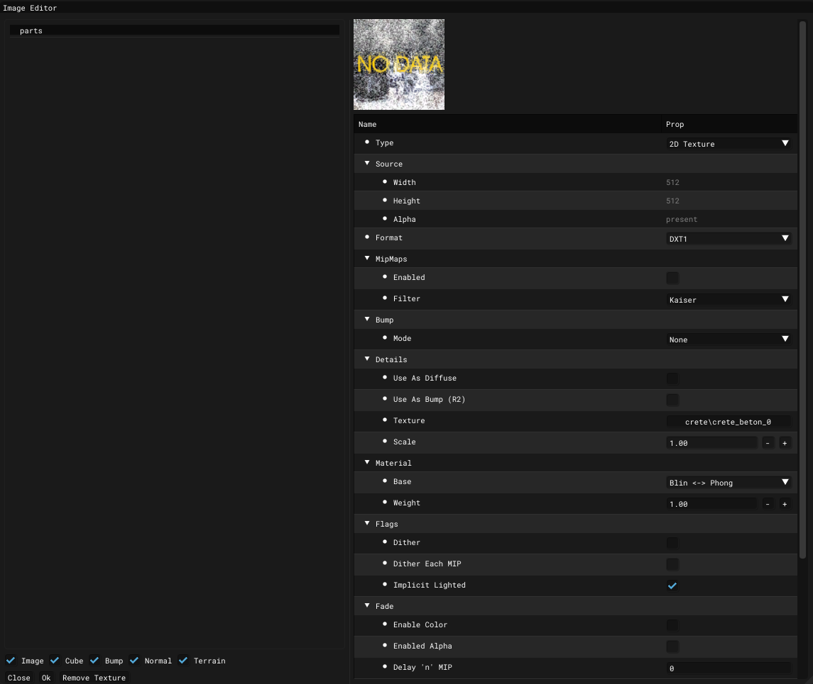

# Image Editor

___

## About

Allows you to edit texture parameters

### General

| Type | Description |
|---|---|
| 2D Texture | Just a texture |
| [Cube Map](https://en.wikipedia.org/wiki/Cube_mapping) | Is a method of environment mapping that uses the six faces of a cube as the map shape |
| Bump Map | Bump |
| Normal Map | Normal Map |
| Terrain |  |

### Source

Shows the characteristics of the texture. Width, height and alpha channel.

### Fromat

| Format | Description |
|---|---|
| DXT1 |  |
| DXT1 Alpha |  |
| DXT3 |   |
| DXT5 |  |
| DBC7 |  |
| 16 bit (1:5:5:5) |  |
| 16 bit (5:6:5) |  |
| 32 bit (8:8:8:8) |  |
| 8 bit (alpha) |  |
| 8 bit (luminance) |  |
| 16 bit (alpha:luminance) |  |

### MipMaps

| MipMaps | Description |
|---|---|
| Enabled |  |
| Advanced |  |
| Point |  |
| Box |  |
| Triangle |  |
| Quadratic |  |
| Cubic |  |
| Catrom |  |
| Michell |  |
| Gaussian |  |
| Sinc |  |
| Bessel |  |
| Hanning |  |
| Hamming |  |
| Blackman |  |
| Kaiser |  |

### Bump

| Bump | Description |
|---|---|
| Mode | None  Use  Use parallax |
| Texture | Path to Bump Textures |

### Details

| Details | Description |
|---|---|
| Use As Diffuse | Use as diffuse detail map |
| Use As Bump (R2) | Use as bump detail map |
| Texture |  |
| Scale | Detail map scale |

### Material

| Material | Description |
|---|---|
| OrenNayar <-> Blin | `Oren-Nayar shading` is a lighting model used in computer graphics to render matte (rough) surfaces with respect to their microgeometry.  `Blinn shading` uses a combination of diffuse and specular light reflection to achieve a more realistic image of shiny objects |
| Blin <-> Phong | `Blinn shading` uses a combination of diffuse and specular light reflection to achieve a more realistic image of shiny objects.  `Phong shading` model can achieve good visual results, making objects appear more three-dimensional and realistic, but at the same time it cannot always accurately reproduce lighting effects on more complex or uneven surfaces |
| Phong <-> Metal | `Phong shading` model can achieve good visual results, making objects appear more three-dimensional and realistic, but at the same time it cannot always accurately reproduce lighting effects on more complex or uneven surfaces.  `Metal shading` is focuses on the realization of materials imitating metallic surfaces |
| Metal <-> OrenNayar | `Metal shading` is focuses on the realization of materials imitating metallic surfaces.  `Oren-Nayar shading` is a lighting model used in computer graphics to render matte (rough) surfaces with respect to their microgeometry |
| PBR |  |
| Weight | “Weight” of shading model  range is 0 - 1 |

### Flags

| Flags | Description |
|---|---|
| Dither |  |
| Dither Each MIP |  |
| Implicit Lighted |  |

### Fade

| Fade | Description |
|---|---|
| Enable Color |  |
| Enable Alpha |  |
| Delay 'n' MIP |  |
| % of colot to fade in  |  |
| Color |  |
| Alpha |  |

### Border

| Border | Description |
|---|---|
| Enable Color |  |
| Enable Alpha |  |
| Color |  |
