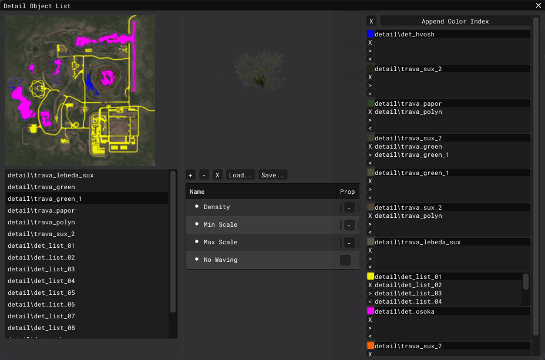

# Level Editor - Detail Object List Window

___

## About

This window creates the relationships between the color slots ([terrain_mask](../../../../reference/file-formats/textures/terrain-mask.md)) and [Detail Objects](../../../../glossary/glossary.html#detail-object).

## Interface

### Right column

Terrane mask texture and list of added Detail Objects.

### Middle column

Model of the selected Detail Object and its properties

#### Buttons

| Name | Description |
|---|---|
| + | Add an object to the list of Detail Objects |
| - | Delete an object from the list of Detail Objects |
| X | Clear the entire list of Detail Objects and color slots |
| Load | Load [*.dti](../../../../reference/file-formats/sdk/dti.md) file |
| Save | Save *.dti file |

#### Detail Object Properties

| Name | Description |
|---|---|
| Density |  |
| Min Scale |  |
| Max Scale |  |
| No Waving |  |

### Left column

Color slots

#### General Buttons

| Name | Description |
|---|---|
| X | Clear the list of color slots |
| Append Color Index | Create a new color slot |

#### Color Slots Buttons

| Name | Description |
|---|---|
| X | Delete a color slot |
| > | Adds the selected Detail Object to the color slot |
| < | Removes the selected Detail Object from the color slot |
