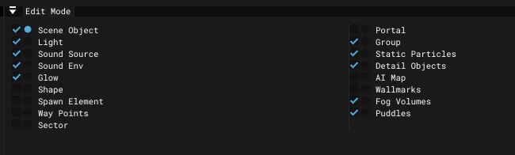

# Level Editor - Edit Mode Window

___

## About

| Icon | Description |
|:---:|---|
|  | Enables group display in [Render Window](render.md) |
|  | Enables the ability to select items in this group in [Render Window](render.md) |

| Name | Description |
|---|---|
| Scene Object | Objects |
| Light | Light sources |
| Sound Source | Sound sources |
| Sound Env | Sound environments |
| Glow | Glow objects |
| Shape | Shape object |
| Spawn Element | Spawn elements |
| Way Points | Way Points |
| Sector | Sectors |
| Portal | Portals |
| Group | Objects in groups |
| Static Particles | Static particles |
| Detail Objects | Detail objects |
| AI Map | AI Map |
| Wallmarks | Wallmarks |
| Fog Volumes | Fog volumes |
| Puddles | Puddles |
