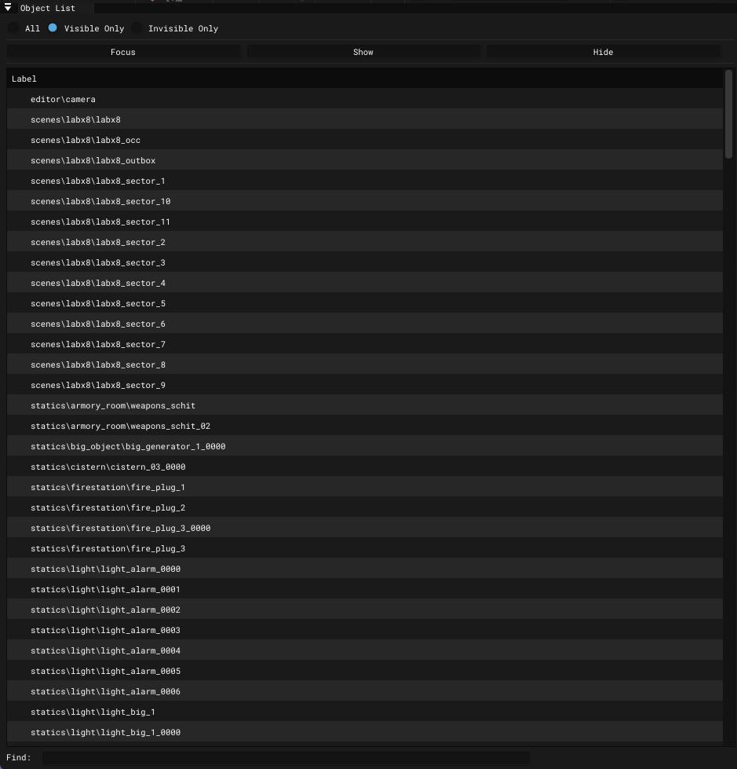

# Level Editor - Object List Window

___

## About

A window with all object types placed on the level.

## Interface

|  |  |
|---|---|
| All | List of all objects on the level |
| Visible Only | List of only objects visible to the camera on the level |
| Invisible Only | List of only objects not visible to the camera on the level |
| Focus | Focusing on a selected object |
| Show | Show object |
| Hide | Hide object |
| Label | Object list |
| Find | Search bar |
