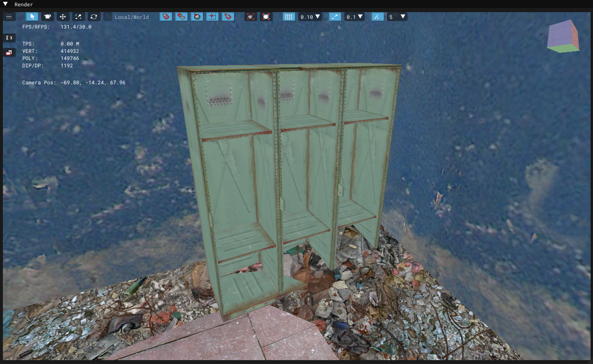

# Level Editor - Render Window

___

## About

| Icon | Name | Description | Note |
|:---:|---|---|---|
|  | Menu |  |  |
|  | Select | Used to select objects | Before the object can be moved, it must be selected with this button |
|  | Add | Adds objects | To add an object, select it in the object panel |
|  | Move | Allows to move objects | - |
|  | Scale | Allows to scale objects | - |
|  | Rotate | Allows to rotate objects | - |
|  | Local/World |  |  |
|  | Object Snap Toggle |  |  |
|  | Moving Snap To Object Toggle |  |  |
|  | Normal Aligment |  |  |
|  | Grid Snap Toggle |  |  |
|  | Vertex Snap Toggle |  |  |
|  | Focus the whole scene |  |  |
|  | Focus on the selected object |  |  |
|  | Fixed object movement |  |  |
|  | Fixed Object Scaling |  |  |
|  | Fixed object rotation angle |  |  |
|  | Parent CS Toggle |  |  |
|  | Scaling by Axes only |  |  |
