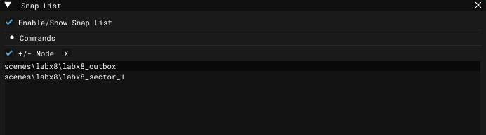

# Level Editor - Snap List Window

___

## About

## Interface

<table><thead>
  <tr>
    <th></th>
    <th>Description</th>
    <th>Extra</th>
    <th>Extra Description</th>
  </tr></thead>
<tbody>
  <tr>
    <td>Enable/Show Snap List</td>
    <td>Selects objects in the Render Window that are in the Snap List</td>
    <td>-</td>
    <td>-</td>
  </tr>
  <tr>
    <td rowspan="4">Commands</td>
    <td rowspan="4"></td>
    <td>Make List From Selected</td>
    <td>Make list from selected</td>
  </tr>
  <tr>
    <td>Select Object From List</td>
    <td>Select object from list</td>
  </tr>
  <tr>
    <td>Add Selected To List</td>
    <td>Add selected to list</td>
  </tr>
  <tr>
    <td>Remove Selected From List</td>
    <td>Remove selected from list</td>
  </tr>
  <tr>
    <td>+/- Mode</td>
    <td>Add selected object to Snap List</td>
    <td>-</td>
    <td>-</td>
  </tr>
  <tr>
    <td>X</td>
    <td>Clear Snap List</td>
    <td>-</td>
    <td>-</td>
  </tr>
</tbody>
</table>
