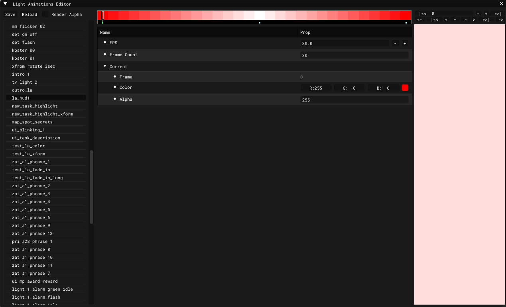

# Light Animations Editor

___

Needed to create a light animation

___

| Button | Description |
|---|---|
| Save | Save |
| Reload | Reload |
| Render Alpha | Will render alpha channel |

___

| Property name | Description |
|---|---|
| FPS | FPS |
| Frame Count | Frame count |
| Frame | Current frame |
| Color | Light color |
| Alpha | Alpha value |

___

| Playback Button | Description |
|---|---|
| \|<< | To first frame |
| - | One frame back |
| + | One frame forward |
| >>\| | To last frame |

| Frame Button | Description |
|---|---|
| <- | Move selected keyframe one frame backward |
| \|<< | ? |
| < | One frame back |
| + | Add keyframe |
| - | Delete keyframe |
| > | One frame forward |
| >>\| | ? |
| -> | Move selected keyframe one frame forward |
