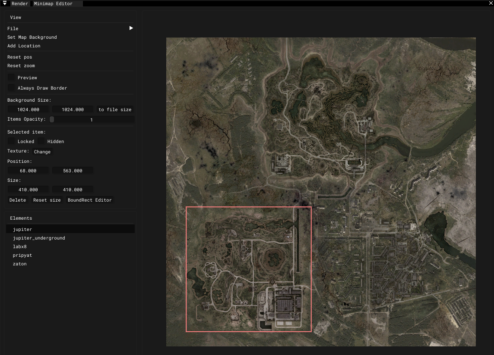

# Minimap Editor

___

## About

<table><thead>
  <tr>
    <th></th>
    <th>Description</th>
    <th>Extra</th>
    <th>Extra Description</th>
  </tr></thead>
<tbody>
  <tr>
    <td rowspan="5">File</td>
    <td rowspan="5">-</td>
    <td>Active File</td>
    <td>Active file</td>
  </tr>
  <tr>
    <td>Save</td>
    <td></td>
  </tr>
  <tr>
    <td>Save As</td>
    <td></td>
  </tr>
  <tr>
    <td>Open</td>
    <td></td>
  </tr>
  <tr>
    <td>Reload</td>
    <td></td>
  </tr>
  <tr>
    <td>Set Map Background</td>
    <td></td>
    <td>-</td>
    <td>-</td>
  </tr>
  <tr>
    <td>Add Location</td>
    <td></td>
    <td>-</td>
    <td>-</td>
  </tr>
  <tr>
    <td>Reset pos</td>
    <td></td>
    <td>-</td>
    <td>-</td>
  </tr>
  <tr>
    <td>Reset zoom</td>
    <td></td>
    <td>-</td>
    <td>-</td>
  </tr>
  <tr>
    <td>Preview</td>
    <td></td>
    <td>-</td>
    <td>-</td>
  </tr>
  <tr>
    <td>Always Draw Border</td>
    <td></td>
    <td>-</td>
    <td>-</td>
  </tr>
  <tr>
    <td>Background Size</td>
    <td></td>
    <td>-</td>
    <td>-</td>
  </tr>
  <tr>
    <td>Item Opacity</td>
    <td></td>
    <td>-</td>
    <td>-</td>
  </tr>
  <tr>
    <td rowspan="2">Selected item</td>
    <td rowspan="2"></td>
    <td>Locked</td>
    <td></td>
  </tr>
  <tr>
    <td>Hidden</td>
    <td></td>
  </tr>
  <tr>
    <td>Texture</td>
    <td>-</td>
    <td>Change</td>
    <td></td>
  </tr>
  <tr>
    <td>Position</td>
    <td></td>
    <td>-</td>
    <td>-</td>
  </tr>
  <tr>
    <td>Size</td>
    <td></td>
    <td>-</td>
    <td>-</td>
  </tr>
  <tr>
    <td>Delete</td>
    <td></td>
    <td>-</td>
    <td>-</td>
  </tr>
  <tr>
    <td>Reset size</td>
    <td>Reset size</td>
    <td>-</td>
    <td>-</td>
  </tr>
  <tr>
    <td>BoundRect Editor</td>
    <td></td>
    <td>-</td>
    <td>-</td>
  </tr>
  <tr>
    <td>Elements</td>
    <td>List of elements</td>
    <td>-</td>
    <td>-</td>
  </tr>
</tbody></table>
