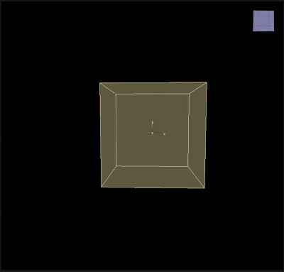

# Damping

___

## About

Simulate air by slowing down particle velocities

<table><thead>
  <tr>
    <th>Key</th>
    <th>Value</th>
    <th>Value Description</th>
  </tr></thead>
<tbody>
  <tr>
    <td rowspan="6">Damping</td>
    <td>Name</td>
    <td></td>
  </tr>
  <tr>
    <td>Damping</td>
    <td>Целевая скорость частицы</td>
  </tr>
  <tr>
    <td>V Low</td>
    <td>Минимальное значение скорости, при котором эффект замедления начинает действовать</td>
  </tr>
  <tr>
    <td>V High</td>
    <td>Максимальное значение скорости, при котором эффект замедления достигает своего максимального воздействия</td>
  </tr>
  <tr>
    <td>Draw</td>
    <td></td>
  </tr>
  <tr>
    <td>Enabled</td>
    <td></td>
  </tr>
</tbody>
</table>
