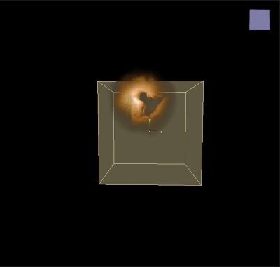

# Kill Old

___

## About

Remove old particles

<table><thead>
  <tr>
    <th>Key</th>
    <th>Value</th>
    <th>Value Description</th>
  </tr></thead>
<tbody>
  <tr>
    <td rowspan="5">KillOld</td>
    <td>Name</td>
    <td></td>
  </tr>
  <tr>
    <td>Age Limit</td>
    <td>Age Limit</td>
  </tr>
  <tr>
    <td>Kill Less Than</td>
    <td>Убивает частицы с "Возрастом" ниже чем указано в Age Limit</td>
  </tr>
  <tr>
    <td>Draw</td>
    <td></td>
  </tr>
  <tr>
    <td>Enabled</td>
    <td></td>
  </tr>
</tbody>
</table>
