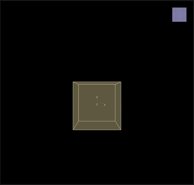

# Target Color

___

## About

Change color of all particles toward the specified color

<table><thead>
  <tr>
    <th>Key</th>
    <th>Value</th>
    <th>Value Description</th>
  </tr></thead>
<tbody>
  <tr>
    <td rowspan="8">TargetColor</td>
    <td>Name</td>
    <td>Action Name</td>
  </tr>
  <tr>
    <td>Color</td>
    <td>Target color</td>
  </tr>
  <tr>
    <td>Alpha</td>
    <td>Target alpha</td>
  </tr>
  <tr>
    <td>Scale</td>
    <td>A coefficient that determines how fast the particles will change their color per frame. A value of 1.0 means that the particles will instantly reach the target color, while values less than 1.0 will change color smoothly</td>
  </tr>
  <tr>
    <td>TimeFrom</td>
    <td>Start of interval (normalized value 0-1)</td>
  </tr>
  <tr>
    <td>TimeTo</td>
    <td>End of interval (normalized value 0-1)</td>
  </tr>
  <tr>
    <td>Draw</td>
    <td></td>
  </tr>
  <tr>
    <td>Enabled</td>
    <td>Enabling or disabling Action</td>
  </tr>
</tbody>
</table>
