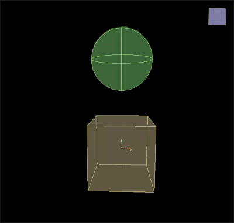

# Avoid

___

## About

Steer particles away from a domain space. Works only with `Plane`, `Rectangle`, `Triangle`, `Disc`, `Sphere` domain types

<table><thead>
  <tr>
    <th>Key</th>
    <th>Value</th>
    <th>Value Description</th>
    <th>Parameter</th>
    <th>Parameter Description</th>
  </tr></thead>
<tbody>
  <tr>
    <td rowspan="18">Avoid</td>
    <td>Name</td>
    <td>Action Name</td>
    <td>-</td>
    <td>-</td>
  </tr>
  <tr>
    <td rowspan="11">Position</td>
    <td rowspan="11">Domen Type</td>
    <td>Point</td>
    <td>Single point</td>
  </tr>
  <tr>
    <td>Line</td>
    <td>Line segment</td>
  </tr>
  <tr>
    <td>Triangle</td>
    <td>Triangle</td>
  </tr>
  <tr>
    <td>Plane</td>
    <td>Arbitrarily-oriented plane</td>
  </tr>
  <tr>
    <td>Box</td>
    <td>Axis-aligned box</td>
  </tr>
  <tr>
    <td>Sphere</td>
    <td>Sphere</td>
  </tr>
  <tr>
    <td>Cylinder</td>
    <td>Cylinder</td>
  </tr>
  <tr>
    <td>Cone</td>
    <td>Cone</td>
  </tr>
  <tr>
    <td>Blob</td>
    <td>Gaussian blob</td>
  </tr>
  <tr>
    <td>Disc</td>
    <td>Arbitrarily-oriented disc</td>
  </tr>
  <tr>
    <td>Rectangle</td>
    <td>Rhombus-shaped planar region</td>
  </tr>
  <tr>
    <td>Magnitude</td>
    <td>Magnitude of impact of action</td>
    <td>-</td>
    <td>-</td>
  </tr>
  <tr>
    <td>Epsilon</td>
    <td>A small numerical constant used to avoid numerical stability problems</td>
    <td>-</td>
    <td>-</td>
  </tr>
  <tr>
    <td>Look Ahead</td>
    <td>Allows particles to “look ahead” and start avoiding areas in advance</td>
    <td>-</td>
    <td>-</td>
  </tr>
  <tr>
    <td>Allow Rotate</td>
    <td></td>
    <td>-</td>
    <td>-</td>
  </tr>
  <tr>
    <td>Draw</td>
    <td>Draw domain</td>
    <td>-</td>
    <td>-</td>
  </tr>
  <tr>
    <td>Enabled</td>
    <td>Enabling or disabling Action</td>
    <td>-</td>
    <td>-</td>
  </tr>
</tbody></table>
