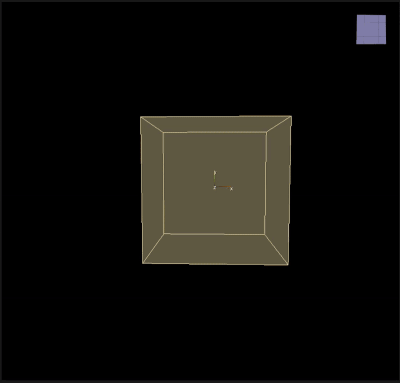

# Damping

___

## About

Simulate air by slowing down particle velocities.

<table><thead>
  <tr>
    <th>Key</th>
    <th>Value</th>
    <th>Value Description</th>
  </tr></thead>
<tbody>
  <tr>
    <td rowspan="6">Damping</td>
    <td>Name</td>
    <td>Action name</td>
  </tr>
  <tr>
    <td>Damping</td>
    <td>Damping constant applied to velocity</td>
  </tr>
  <tr>
    <td>V Low</td>
    <td>Minimum speed at which the deceleration effect starts to take effect</td>
  </tr>
  <tr>
    <td>V High</td>
    <td>Maximum speed at which the deceleration effect reaches its maximum effect</td>
  </tr>
  <tr>
    <td>Draw</td>
    <td></td>
  </tr>
  <tr>
    <td>Enabled</td>
    <td>Enabling or disabling Action</td>
  </tr>
</tbody>
</table>
