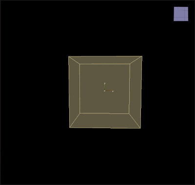

# Gravity

___

## About

Accelerate particles in the given direction

<table><thead>
  <tr>
    <th>Key</th>
    <th>Value</th>
    <th>Value Description</th>
  </tr></thead>
<tbody>
  <tr>
    <td rowspan="4">Gravity</td>
    <td>Name</td>
    <td>Action Name</td>
  </tr>
  <tr>
    <td>Direction</td>
    <td>Gravity direction</td>
  </tr>
  <tr>
    <td>Draw</td>
    <td></td>
  </tr>
  <tr>
    <td>Enabled</td>
    <td>Enabling or disabling Action</td>
  </tr>
</tbody>
</table>
