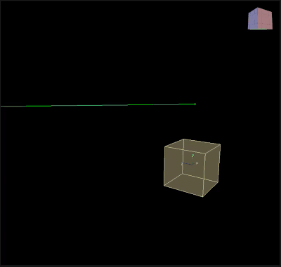

# Orbit Line

## About

Effect of orbital motion of particles around a given line (axis). The particles are attracted to the nearest point on the line with a force depending on the distance

<table><thead>
  <tr>
    <th>Key</th>
    <th>Value</th>
    <th>Value Description</th>
  </tr></thead>
<tbody>
  <tr>
    <td rowspan="9">OrbitLine</td>
    <td>Name</td>
    <td>Action Name</td>
  </tr>
  <tr>
    <td>Position</td>
    <td>Action position</td>
  </tr>
  <tr>
    <td>Axis</td>
    <td>Line direction vector</td>
  </tr>
  <tr>
    <td>Magnitude</td>
    <td>Magnitude of impact of action</td>
  </tr>
  <tr>
    <td>Epsilon</td>
    <td>A small numerical constant used to avoid numerical stability problems</td>
  </tr>
  <tr>
    <td>Max Radius</td>
    <td>Maximum radius within which particles will be affected. Particles outside this radius will not be affected</td>
  </tr>
  <tr>
    <td>Allow Rotate</td>
    <td></td>
  </tr>
  <tr>
    <td>Draw</td>
    <td></td>
  </tr>
  <tr>
    <td>Enabled</td>
    <td>Enabling or disabling Action</td>
  </tr>
</tbody>
</table>
