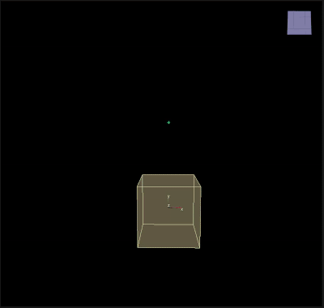

# Orbit Point

___

## About

Realizes the physics of particle attraction/repulsion relative to a given point in 3D space.

<table><thead>
  <tr>
    <th>Key</th>
    <th>Value</th>
    <th>Value Description</th>
  </tr></thead>
<tbody>
  <tr>
    <td rowspan="8">OrbitPoint</td>
    <td>Name</td>
    <td>Action name</td>
  </tr>
  <tr>
    <td>Center</td>
    <td>Action center</td>
  </tr>
  <tr>
    <td>Magnitude</td>
    <td>Magnitude of impact of action</td>
  </tr>
  <tr>
    <td>Epsilon</td>
    <td>A small numerical constant used to avoid numerical stability problems</td>
  </tr>
  <tr>
    <td>Max Radius</td>
    <td>Maximum radius within which particles will be affected. Particles outside this radius will not be affected</td>
  </tr>
  <tr>
    <td>Allow Rotate</td>
    <td></td>
  </tr>
  <tr>
    <td>Draw</td>
    <td></td>
  </tr>
  <tr>
    <td>Enabled</td>
    <td>Enabling or disabling Action</td>
  </tr>
</tbody>
</table>
